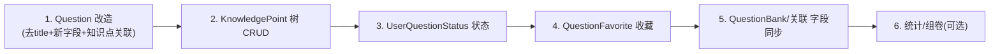

# Controller 接口改造清单

> 基于数学刷题站的数据模型改造（题目去 `title`、新增 `questionType/difficulty/options/analysis/source/picture`；新增知识点树、题目-知识点关联、做题状态、收藏）。本文件列出**每个 Controller 要新增 / 修改的接口**。
>
> 图例：🆕 新增　✏️ 修改　✅ 保持不变（仅列关键项）

---

## 1. QuestionController（`/question`）

数学题字段变化最大，重点在去 `title`、补题型/难度/知识点。

| 方法                            | 路径                            | 动作     | 说明                                                                                                                                                                                            |
| ----------------------------- | ----------------------------- | ------ | --------------------------------------------------------------------------------------------------------------------------------------------------------------------------------------------- |
| `addQuestion`                 | `POST /add`                   | ✏️     | 入参改为新 `QuestionAddRequest`（去 `title`，加 `questionType`、`difficulty`、`options`、`analysis`、`source`、`picture`、`knowledgePointIds`）；保存题目后写入 `question_knowledge_point` 关联；建议加 `@AuthCheck(admin)` |
| `updateQuestion`              | `POST /update`                | ✏️     | 同步上述新字段；更新知识点关联（先删后插或差量）；建议 `@AuthCheck(admin)`                                                                                                                                               |
| `getQuestionVO`               | `GET /get/vo`                 | ✏️     | `QuestionVO` 去 `title`，补题型/难度/解析/选项/所属知识点列表                                                                                                                                                   |
| `listQuestionVO`              | `POST /list/page/vo`          | ✏️     | 查询条件支持按 `questionType`、`difficulty`、`knowledgePointId`（含子树）筛选                                                                                                                                 |
| `listQuestion`                | `POST /list/page`             | ✏️     | 管理员原始分页，同步新字段                                                                                                                                                                                 |
| `deleteQuestion`              | `POST /delete`                | ✏️     | 删除题目时一并清理 `question_knowledge_point` 关联；建议 `@AuthCheck(admin)`                                                                                                                                |
| `searchFromEs`                | `POST /search/page/vo`        | ✏️     | ES 查询字段去 `title`，改以 `content` 为主，补 `questionType/difficulty` 过滤                                                                                                                               |
| `getQuestionByKnowledgePoint` | `POST /list/byKnowledgePoint` | 🆕     | 专项练习：按知识点节点（含子树 `path LIKE`）抽题                                                                                                                                                                |
| `randomQuestions`             | `POST /random`                | 🆕（可选） | 组卷取数：按知识点/难度/题型/数量随机抽题                                                                                                                                                                        |

**配套改造：**

- `QuestionAddRequest` / `QuestionUpdateRequest` / `QuestionQueryRequest` / `QuestionVO`：去 `title`，加新字段 + `knowledgePointIds`
- `QuestionServiceImpl.validQuestion`：删除 `title` 校验，增加 `questionType`（枚举校验）、`difficulty`（1-5）校验
- `QuestionServiceImpl.getQueryWrapper` / `searchFromEs`：移除 `title` 的 like/match

---

## 2. KnowledgePointController（`/knowledgePoint`）🆕 全新

知识点目录树的增删改查与树形获取。

| 方法                       | 路径                        | 动作     | 权限                                       |
| ------------------------ | ------------------------- | ------ | ---------------------------------------- |
| `addKnowledgePoint`      | `POST /add`               | 🆕     | admin；写入时根据 `parentId` 维护 `path`、`level` |
| `updateKnowledgePoint`   | `POST /update`            | 🆕     | admin；改名/移动节点（移动需级联更新子树 `path`）          |
| `deleteKnowledgePoint`   | `POST /delete`            | 🆕     | admin；有子节点或被题目引用时校验/拦截                   |
| `listKnowledgePointTree` | `GET /tree`               | 🆕     | 公开；返回整棵树（应用层组装 children，可加 Redis 缓存）     |
| `listChildren`           | `GET /children?parentId=` | 🆕（可选） | 懒加载某节点子节点                                |

**配套：** `KnowledgePointService` / `KnowledgePointVO`（带 `children`）、`path/level` 维护逻辑。

---

## 3. UserQuestionStatusController（`/userQuestionStatus`）🆕 全新

做题状态：三态 + 完成时对错；每用户每题一条。

| 方法             | 路径                     | 动作     | 说明                                                                                                                   |
| -------------- | ---------------------- | ------ | -------------------------------------------------------------------------------------------------------------------- |
| `updateStatus` | `POST /update`         | 🆕     | 入参 `questionId`、`status`、`result`；幂等 upsert（`ON DUPLICATE KEY UPDATE` 或先查后存）；校验：`done` 必须带 `result`，其余 `result` 必须为空 |
| `getStatus`    | `GET /get?questionId=` | 🆕     | 查当前用户某题状态                                                                                                            |
| `listMyStatus` | `POST /list/page`      | 🆕     | 按 `status` 分页查"我的"题目（如待完成列表）                                                                                         |
| `listWrong`    | `POST /list/wrong`     | 🆕（可选） | `status=done & result=wrong` 错题列表（错题本雏形）                                                                             |

**配套：** `UserQuestionStatusService`、`UserQuestionStatusUpdateRequest`、`UserQuestionStatusQueryRequest`、`QuestionStatusEnum`/`QuestionResultEnum` 校验。

---

## 4. QuestionFavoriteController（`/questionFavorite`）🆕 全新

个人收藏，硬删除。

| 方法               | 路径                     | 动作     | 说明                           |
| ---------------- | ---------------------- | ------ | ---------------------------- |
| `addFavorite`    | `POST /add`            | 🆕     | 入参 `questionId`；唯一约束防重复，幂等   |
| `removeFavorite` | `POST /delete`         | 🆕     | 按 `questionId` 物理删除          |
| `listMyFavorite` | `POST /list/page`      | 🆕     | 分页查"我的收藏"题目（关联 `QuestionVO`） |
| `isFavorite`     | `GET /get?questionId=` | 🆕（可选） | 详情页显示是否已收藏                   |

**配套：** `QuestionFavoriteService`、查询用 `userId = 当前用户`。

---

## 5. QuestionBankController（`/questionBank`）

题库复用为"练习集/试卷"，改动小。

| 方法                  | 路径             | 动作  | 说明                                              |
| ------------------- | -------------- | --- | ----------------------------------------------- |
| `getQuestionBankVO` | `POST /get/vo` | ✏️  | 题目分页内的字段随 `Question`/`QuestionVO` 变化（去 title 等） |
| 其余 CRUD             | —              | ✅   | 基本不变                                            |

---

## 6. QuestionBankQuestionController（`/questionBankQuestion`）

✅ 接口签名基本不变。仅注意返回题目信息时字段随新 `Question` 同步。可选：分页返回时联表带出题型/难度，便于组卷预览。

---

## 7. UserController（`/user`）

✅ 现有接口不变（注册/登录/CRUD/签到）。

可选增强（非必需）：

- 学习统计入口（正确率、各知识点掌握度），可放新 `StatisticsController` 或挂在用户下。

---

## 改造优先级建议

| 阶段  | 内容                                          | 必要性 |
| --- | ------------------------------------------- | --- |
| P0  | Question 去 title + 新字段；DTO/VO/Service/ES 同步 | 必须  |
| P0  | KnowledgePoint 树 CRUD + tree 接口             | 必须  |
| P1  | UserQuestionStatus 状态接口                     | 必须  |
| P1  | QuestionFavorite 收藏接口                       | 必须  |
| P2  | 专项练习/随机组卷取题                                 | 推荐  |
| P2  | 学习统计、错题本增强                                  | 可选  |

---

## 附：受影响的非 Controller 文件

| 文件                                                         | 改动                                                                 |
| ---------------------------------------------------------- | ------------------------------------------------------------------ |
| `QuestionAddRequest/UpdateRequest/QueryRequest/QuestionVO` | 去 `title`，加题型/难度/options/analysis/source/picture/knowledgePointIds |
| `QuestionServiceImpl`                                      | `validQuestion`、`getQueryWrapper`、`searchFromEs` 去 title 逻辑、加新字段   |
| `QuestionEsDto` + `question_es_mapping.json`               | 去 `title`，加 `questionType`/`difficulty`（keyword）                   |
| 新增 Service/VO/DTO                                          | KnowledgePoint、UserQuestionStatus、QuestionFavorite 各一套             |

