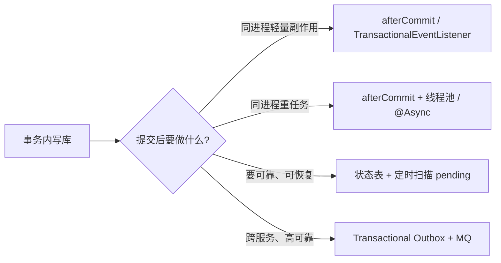
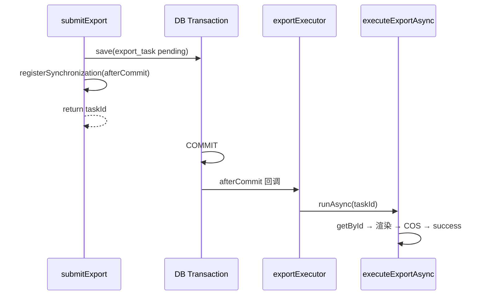

# 事务提交后触发异步任务 — 最佳实践调研

> 面向本项目 `interview_copilot`（Spring Boot 2.7.2 / MyBatis-Plus / Druid）。  
> 关联场景：[组卷与导出功能设计](./组卷与导出功能设计.md) §4 导出异步流程；[接口幂等与防重复提交](./接口幂等与防重复提交.md)。  
> 本文档源于 `ExportTaskServiceImpl#submitExport` 中「事务未提交就 `runAsync`，异步线程 `getById` 返回 null」的真实故障。

---

## 1. 问题是什么

### 1.1 典型错误写法

```java
@Transactional(rollbackFor = Exception.class)
public Long submitExport(ExamPaperExportRequest request) {
    // ... 校验 ...
    this.save(task);                          // ① INSERT，事务尚未提交
    Long taskId = task.getId();               // ② 内存里已有 id（MyBatis-Plus 回填）
    CompletableFuture.runAsync(
        () -> executeExportAsync(taskId),     // ③ 另一线程立刻查库
        exportExecutor
    );
    return taskId;                            // ④ 方法结束 → 事务才提交
}
```

### 1.2 表象 vs 根因

| 表象 | 容易误判 |
|------|----------|
| 日志：`导出任务不存在, taskId=9` | 「save 失败了？」「id 没回填？」 |
| 列表接口能查到 `pending` 任务 | 「数据库明明有记录啊」 |

**根因不是任务没创建，而是「读得太早」：**

```
主线程（事务 A）                    异步线程（无事务 / 新连接）
─────────────────                  ─────────────────────────
save(task)  → 未提交
runAsync()  → 启动
                                   getById(taskId) → null（读不到未提交行）
submitExport 返回
事务 A commit  → 记录才对外可见
```

### 1.3 背后的数据库与 Spring 机制

| 机制 | 说明 |
|------|------|
| **事务隔离（MySQL 默认 READ COMMITTED）** | 其他连接读不到本事务未提交的数据 |
| **Spring 事务线程绑定** | 同一 `@Transactional` 内的 DB 操作共用一个连接；`runAsync` 在**新线程**，拿不到该连接上的未提交视图 |
| **对象 id ≠ 已提交记录** | `task.getId()` 来自 ORM 回填，只代表「本事务内已执行 INSERT」，不代表「全局可见」 |

> 面试一句话：**「事务内的写，在 commit 之前对其他线程不可见；在事务方法里直接 fire-and-forget 异步查库，是典型的 post-commit 时序错误。」**

---

## 2. 方案全景（由简到繁）



### 2.1 方案对比

| 方案 | 复杂度 | 可靠性 | 适用场景 | 本项目导出任务 |
|------|--------|--------|----------|----------------|
| **A. 事务外触发（Controller 调两次）** | 低 | 中 | 极简 demo | ❌ 职责混乱，不推荐 |
| **B. `TransactionSynchronization.afterCommit`** | 低 | 中 | 单体、同进程异步 | ✅ **当前已采用** |
| **C. `@TransactionalEventListener(AFTER_COMMIT)`** | 中 | 中 | 解耦、多监听者 | ✅ 推荐演进方向 |
| **D. `afterCommit` + 状态表轮询兜底** | 中 | **高** | 长任务、怕进程崩溃 | ✅ 导出场景强烈建议叠加 |
| **E. Transactional Outbox + MQ** | 高 | **很高** | 微服务、跨系统 | 规模上来后再考虑 |

---

## 3. 各方案详解与最佳实践

### 3.1 方案 B：`TransactionSynchronization.afterCommit`（当前实现）

```java
Long taskId = task.getId();
TransactionSynchronizationManager.registerSynchronization(new TransactionSynchronization() {
    @Override
    public void afterCommit() {
        CompletableFuture.runAsync(() -> executeExportAsync(taskId), exportExecutor);
    }
});
```

**优点**

- 改动小，不引入新基础设施
- 严格保证：**只有 commit 成功才触发**；rollback 时 `afterCommit` 不执行

**注意点**

| 点 | 说明 |
|----|------|
| 必须在**活跃事务**中注册 | 无事务时 `registerSynchronization` 可能无效或行为不符合预期 |
| `afterCommit` 内抛异常**不会回滚**原事务 | 原事务已提交；需在异步方法内自行 `markFailed` |
| 进程在 commit 后、异步执行前崩溃 | 任务会永远 `pending` → 需要**轮询兜底**（见 §3.4） |
| 不要传整个 `ExportTask` 实体进异步 | 传 `taskId` 等不可变标识，commit 后重新查库拿最新状态 |

**何时选它**：单体应用、异步逻辑仍在同一 JVM、任务允许「至少触发一次」且可用状态表补偿。

---

### 3.2 方案 C：`@TransactionalEventListener` + 领域事件（Spring 官方更推荐的结构化写法）

Spring 文档与社区实践普遍建议：用**领域事件**表达「业务事实已持久化」，用 `@TransactionalEventListener` 绑定事务阶段，而不是在 Service 里手写 `registerSynchronization`。

**发布方（事务内）**

```java
// 1. 定义事件
public record ExportTaskSubmittedEvent(Long taskId) {}

// 2. 事务方法末尾
this.save(task);
applicationEventPublisher.publishEvent(new ExportTaskSubmittedEvent(task.getId()));
```

**消费方（独立 Listener）**

```java
@Component
@RequiredArgsConstructor
@Slf4j
public class ExportTaskEventListener {

    private final ExportTaskService exportTaskService;

    @Async("exportExecutor")  // 建议用 Spring 管理的线程池 Bean
    @TransactionalEventListener(phase = TransactionPhase.AFTER_COMMIT)
    public void onExportTaskSubmitted(ExportTaskSubmittedEvent event) {
        exportTaskService.executeExportAsync(event.taskId());
    }
}
```

**`TransactionPhase` 选型**

| Phase | 含义 | 典型用途 |
|-------|------|----------|
| `AFTER_COMMIT`（默认） | 提交成功后 | 发邮件、推 MQ、启动异步导出 |
| `AFTER_ROLLBACK` | 回滚后 | 审计、告警 |
| `BEFORE_COMMIT` | 提交前 | 同事务内校验（少用） |
| `AFTER_COMPLETION` | 提交或回滚后 | 清理资源 |

**与 `@EventListener` 的区别（面试常考）**

- `@EventListener`：事件发出后**立即**执行，仍在同一事务语义下；若事务回滚，副作用可能已发生 → **不适合**「发邮件 / 启动导出」
- `@TransactionalEventListener(AFTER_COMMIT)`：仅 commit 成功后执行 → **适合** post-commit 副作用

**`fallbackExecution = true`**

无事务上下文时是否仍执行 listener。导出提交路径应始终在 `@Transactional` 内，一般保持默认 `false`，避免误触发。

**Listener 内再做 DB 写**

`AFTER_COMMIT` 时原事务已结束。若 listener **同步**执行且要写库，需 `@Transactional(propagation = Propagation.REQUIRES_NEW)`。  
本项目 `executeExportAsync` 在 `@Async` 新线程执行，Spring 事务线程绑定天然断开，每次 `updateById` 会各自开启短事务，通常不必额外标 `REQUIRES_NEW`，但语义上要清楚：**异步执行路径已是独立事务边界**。

**何时选它**：同一应用内有多处「写库后触发副作用」、希望 Service 保持单一职责、便于单测与扩展（加监听器不改 `submitExport`）。

---

### 3.3 方案 A：拆到事务外（反模式，仅作对比）

```java
// Controller
Long taskId = exportTaskService.createPendingTask(request);  // 无事务或短事务
exportTaskService.executeExportAsync(taskId);                  // 事务外触发
```

问题：入口层承担编排、两次调用间可能失败、幂等与权限校验容易分散。**不推荐**作为正式方案，除非极简脚本。

---

### 3.4 方案 D：状态表 + 定时扫描（导出类长任务的必配兜底）

本项目已有 `export_task.status = pending | processing | success | failed`，这本身就是 **Job Table / Task Queue** 模式的基础。

**仅靠 `afterCommit + runAsync` 仍不够的原因**

| 故障 | 结果 |
|------|------|
| JVM 在 `afterCommit` 后、线程池执行前 OOM / kill | 任务永久 `pending` |
| 异步线程执行前应用重启（DevTools 热重启） | 同上 |
| 线程池队列满 + `CallerRunsPolicy` 行为异常 | 延迟或丢失触发 |
| 历史 bug（提交前触发）+ 幂等直接返回旧 `taskId` | 僵尸 `pending` 永不执行 |

**最佳实践：双轨触发（Push + Pull）**

```
提交成功 ──afterCommit──> 线程池立即执行（低延迟）
                │
                └── 同时任务已是 pending 行（可恢复）

定时任务（每 1~5 分钟）──> SELECT pending WHERE createTime < now() - 2min
                         FOR UPDATE SKIP LOCKED   -- MySQL 8+ 防多实例抢同一条
                         ──> executeExportAsync(taskId)
```

**扫描条件建议**

- `status = pending`
- `createTime` 超过阈值（如 2 分钟），避免与正常 `afterCommit` 触发抢跑
- 可选：`retry_count < 3`，超限标 `failed`

**幂等配合（本项目额外坑）**

当前逻辑：相同 `idempotentKey` 且非 `failed` 时直接 `return existed.getId()`，**不会重新触发异步**。  
对卡死的 `pending` 任务，应在幂等分支增加：

```java
if (ExportStatusEnum.PENDING.getValue().equals(existed.getStatus())) {
    scheduleExportAfterCommit(existed.getId());  // 重新调度，executeExportAsync 内已有 pending 校验
    return existed.getId();
}
```

或要求用户先手动将任务标为 `failed` 再重试。

**何时选它**：所有「写一条任务记录 + 异步执行」的场景，**应与 afterCommit 叠加**，而不是二选一。

---

### 3.5 方案 E：Transactional Outbox（跨服务 / 极高可靠）

当副作用是「通知另一个系统」或「消息必须不丢」时，业界标准解法是 **Transactional Outbox**：

```
同一 DB 事务内：
  INSERT export_task ...
  INSERT outbox(event_type, payload, status=PENDING) ...

独立 Relay（轮询或 CDC）：
  读 outbox PENDING → 发 Kafka/RabbitMQ → 标 SENT
```

| 实现方式 | 特点 |
|----------|------|
| 轮询 `outbox` 表 | 简单，有 DB 压力，需 `SKIP LOCKED` |
| CDC（Debezium 读 WAL） | 生产级，低延迟，无轮询开销 |

本项目导出若始终在同一 JVM 内用 `export_task` 驱动，**不必上 Outbox**；若未来拆成独立「导出微服务」或由 Kafka 消费，再引入。

Microsoft Azure Architecture、Debezium 等文档均强调：Outbox 保证 **DB 写入与「待发送消息」原子一致**，解决的是 **dual write** 问题，与本文「同事务内触发同进程异步」是不同层级，但思想一致：**先持久化意图，再异步执行**。

---

## 4. 针对本项目的推荐架构

### 4.1 当前阶段（单体 MVP）



**清单**

- [x] `afterCommit` 后再 `runAsync`（已修复）
- [ ] 幂等命中 `pending` 时重新调度（建议补）
- [ ] 定时扫描超时 `pending`（建议补）
- [ ] 线程池改为 Spring `@Bean`，便于监控与优雅停机
- [ ] 可选：演进为 `ExportTaskSubmittedEvent` + `@TransactionalEventListener`

### 4.2 演进阶段（多实例部署）

在 MVP 清单基础上增加：

- 定时任务加分布式锁（Redisson，本项目已有）或 `SKIP LOCKED`
- `processing` 超时回滚为 `pending`（防止 worker 宕机卡在 processing）
- 导出任务指标：pending 堆积数、平均耗时、失败率

### 4.3 未来阶段（导出服务独立）

- `export_task` 即 Outbox / Job 表
- 通过 MQ 或 CDC 将 `taskId` 投递给导出 Worker
- API 只负责创建任务与查询状态

---

## 5. 其他常见坑（Checklist）

### 5.1 事务与异步

| 坑 | 正确做法 |
|----|----------|
| 事务内 `runAsync` 查刚插入的数据 | `afterCommit` 或事件 `AFTER_COMMIT` |
| 事务内 `@Async` 方法自调用 | 通过 Spring 代理调用（另一 Bean），否则 `@Async` 不生效 |
| 异步线程需要登录用户上下文 | `UserContext` / `SecurityContext` 需手动传递，commit 前拷贝到事件对象 |
| `afterCommit` 里再开事务写库 | 新线程天然新事务；同步 listener 需 `REQUIRES_NEW` |

### 5.2 可靠性

| 坑 | 正确做法 |
|----|----------|
| 只 fire-and-forget，无状态 | 用 `pending` 任务表 + 轮询兜底 |
| 执行成功但更新状态失败 | 关键步骤幂等；COS 上传用确定性 `fileKey`；可安全重试 |
| 重复执行导出 | `executeExportAsync` 入口校验 `status == pending`（本项目已有） |

### 5.3 与幂等的关系

```
幂等键防的是：重复 HTTP 请求不要插入多条任务
afterCommit 防的是：第一条任务插入后，异步能读到这条记录

两者正交，都要做。
```

僵尸 `pending` 是 **幂等返回旧 ID 但不重新调度** 与 **历史 afterCommit 时序 bug** 叠加的结果，需分别修。

---

## 6. 代码模板速查

### 6.1 afterCommit 工具方法（减少样板代码）

```java
private void runAfterCommit(Runnable action) {
    if (!TransactionSynchronizationManager.isSynchronizationActive()) {
        action.run();  // 无事务时直接执行，或抛异常强制调用方加 @Transactional
        return;
    }
    TransactionSynchronizationManager.registerSynchronization(new TransactionSynchronization() {
        @Override
        public void afterCommit() {
            action.run();
        }
    });
}

// 使用
runAfterCommit(() -> CompletableFuture.runAsync(
    () -> executeExportAsync(taskId), exportExecutor));
```

### 6.2 事件驱动（推荐演进）

见 §3.2 完整示例。启用 `@EnableAsync` 并将 `exportExecutor` 注册为 `@Bean("exportExecutor")`。

### 6.3 超时 pending 扫描（建议新增）

```java
@Scheduled(fixedDelay = 120_000)
public void recoverStuckPendingTasks() {
    List<ExportTask> stuck = exportTaskMapper.selectList(
        new LambdaQueryWrapper<ExportTask>()
            .eq(ExportTask::getStatus, ExportStatusEnum.PENDING.getValue())
            .lt(ExportTask::getCreateTime, DateUtil.offsetMinute(new Date(), -2))
            .last("LIMIT 20"));
    for (ExportTask task : stuck) {
        exportExecutor.execute(() -> executeExportAsync(task.getId()));
    }
}
```

多实例部署时，在方法外加 Redisson 锁或使用 `SELECT ... FOR UPDATE SKIP LOCKED`。

---

## 7. 面试讲法（30 秒 / 2 分钟）

**30 秒版**

> 我们在事务里插入 `export_task` 后立刻 `CompletableFuture.runAsync`，异步线程用新连接 `getById` 读不到未提交数据，所以报任务不存在。修法是 `TransactionSynchronization.afterCommit` 或 `@TransactionalEventListener(AFTER_COMMIT)`，保证 commit 后再调度。导出这种长任务还要用 `pending` 状态表加定时扫描兜底，防止进程崩溃后任务丢失。

**2 分钟版（可展开）**

1. **问题定性**：不是 ORM 没回填 id，而是 MVCC + 事务隔离导致跨线程读不到 uncommitted row。  
2. **解法分层**：轻量副作用用 afterCommit；结构化用 TransactionalEventListener；可靠任务用 Job 表 + 扫描；跨服务用 Outbox。  
3. **本项目选型**：`export_task` 已是 Job 表，afterCommit 负责低延迟，扫描负责恢复；幂等要对 `pending` 允许重新调度。  
4. **与幂等关系**：幂等解决重复提交，afterCommit 解决可见性，互不替代。

---

## 8. 参考资料

| 来源 | 主题 |
|------|------|
| [Spring Framework — TransactionalEventListener](https://docs.spring.io/spring-framework/reference/data-access/transaction/declarative/annotations.html) | 事务阶段与事件监听 |
| [Bart Slota — Transaction synchronization and Spring application events](https://www.bartslota.com/post/transaction-synchronization-and-spring-application-events-understanding-transactionaleventlistene) | AFTER_COMMIT 与 REQUIRES_NEW |
| [Microsoft — Transactional Outbox pattern](https://learn.microsoft.com/en-us/azure/architecture/databases/guide/transactional-out-box-cosmos) | Outbox 原子性与 Relay |
| [Debezium / Outbox 实践](https://www.decodable.co/blog/revisiting-the-outbox-pattern) | CDC vs 轮询 |
| 本项目 [组卷与导出功能设计](./组卷与导出功能设计.md) | 导出异步时序图 |
| 本项目 [接口幂等与防重复提交](./接口幂等与防重复提交.md) | 幂等键与 `export_task` |

---

## 9. 结论

| 问题 | 最佳实践 |
|------|----------|
| 事务内写库后立刻异步读库 | **必须**等 `afterCommit`（或等价事件机制） |
| 单体、同 JVM 异步 | `TransactionSynchronization` 或 `@TransactionalEventListener` + `@Async` |
| 长任务、可恢复 | **状态表 + afterCommit 推送 + 定时拉取** 双轨 |
| 跨服务、消息不丢 | Transactional Outbox + MQ / CDC |
| 本项目当前 | 已用 afterCommit；建议补 pending 重新调度 + 超时扫描 |

**一句话：先让数据「提交可见」，再让副作用「可靠执行」；可见性用 afterCommit，可靠性用任务状态机 + 补偿扫描。**
