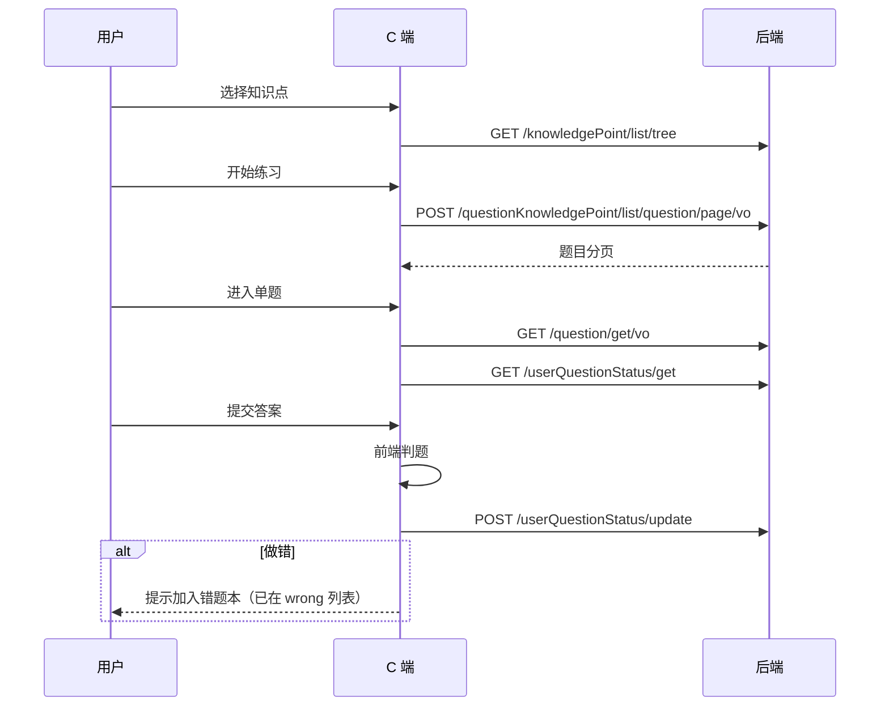
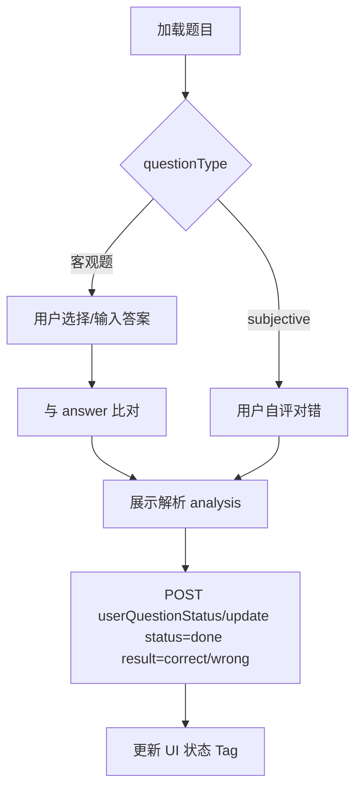
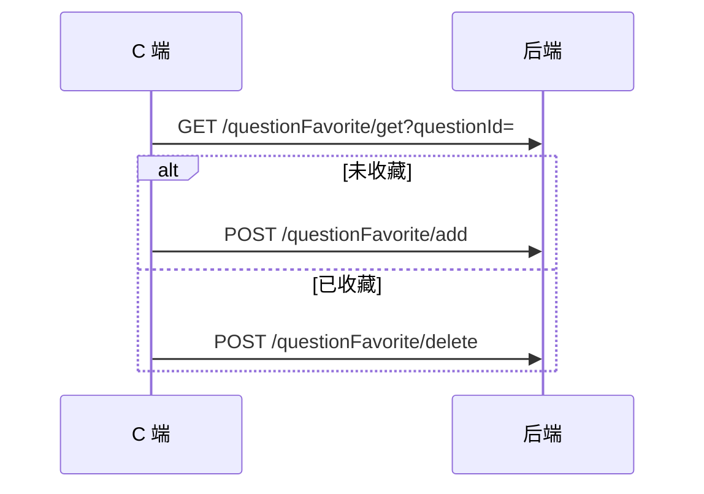

# 数学刷题平台 —— 客户网页端（C 端）前端设计文档

> 基于当前后端代码（Spring Boot 2.7 + JWT + MyBatis-Plus）整理，供用户端 Web 前端开发与联调使用。  
> 文档版本：v1.0 · 更新日期：2026-06-07

---

## 1. 文档说明

| 项 | 内容 |
|----|------|
| 文档名称 | 客户网页端（C 端）前端设计文档 |
| 适用读者 | 前端开发、UI 设计、后端联调、测试、产品 |
| 产品范围 | **C 端用户 Web**（刷题、专项练习、题库浏览、收藏、错题、个人中心） |
| 不包含 | B 端管理后台（见 [管理端前端设计文档](./管理端前端设计文档.md)） |
| 后端基址 | `http://{host}:8101/api` |
| 接口文档 | `http://{host}:8101/api/doc.html`（Knife4j） |
| 关联文档 | [数学刷题网站设计与技术亮点](./数学刷题网站设计与技术亮点.md)、[Controller接口改造清单](./Controller接口改造清单.md) |

---

## 2. 项目背景与目标

### 2.1 背景

平台由「面试题库 Copilot」改造为**数学刷题平台**，C 端面向学生/自学者，核心能力包括：

- 按**知识点树**导航，进行**专项练习**
- 浏览**题库（练习集 / 专题卷）**并逐题作答
- **客观题**在线作答与自动判题；**主观题**支持标记完成与自评对错
- **收藏**、**错题本**、**做题状态**沉淀学习数据
- 题干 / 答案 / 解析支持 **LaTeX**（KaTeX 渲染）

产品长期规划包含「组卷 → 导出 PDF → 离线作答 → 回填批改」闭环，**当前后端尚未提供导出/组卷接口**，本文档 MVP 以在线刷题为主，导出能力见 §12 预留。

### 2.2 C 端目标

1. 用户注册登录后，可按知识点或题库高效刷题
2. 做题过程流畅：选题 → 作答 → 判题/自评 → 更新状态 → 错题/收藏联动
3. 与现有 REST API **字段一一对应**，不自造业务字段
4. 界面简洁、偏学习工具风格，数学公式渲染准确

### 2.3 成功标准（MVP）

- 用户可注册、登录、维护个人资料与头像
- 可按知识点树进入专项练习，分页浏览并做题
- 可浏览题库列表与详情，逐题练习
- 客观题可提交答案并标记对错；主观题可标记「已完成 + 自评」
- 收藏 / 取消收藏、错题列表、签到日历可用
- 题目列表支持 MySQL `searchText` 筛选（ES 搜索暂不可用）

---

## 3. 角色与权限

### 3.1 角色定义

| 角色值 | 说明 | C 端 |
|--------|------|------|
| `user` | 普通用户 | ✅ 默认角色，可使用全部 C 端能力 |
| `admin` | 管理员 | ✅ 可登录 C 端（建议跳转管理端或隐藏管理入口） |
| `ban` | 封禁 | ⚠️ JWT 仍可能解析成功，但 `@AuthCheck` 及业务层会拒绝；需友好提示 |

### 3.2 鉴权机制

```
注册 POST /user/register        → 公开（白名单）
登录 POST /user/login           → 公开（白名单）
       ↓
响应 LoginUserVO.token
       ↓
前端持久化 token（localStorage 推荐）

后续请求 Header:
  token: {jwt}

全局 UserInfoInterceptor：除白名单外，所有 /api/** 必须携带有效 token
  → 无 token / 无效：40100 或 40300（JWT 校验失败）
  → token 过期：40300

需登录的业务接口（收藏、做题状态、签到等） additionally 校验 UserContext
  → 未登录：40100
```

⚠️ **重要**：当前后端白名单**仅** `/user/login`、`/user/register`。  
因此 **题目列表、题库列表、知识点树等读接口也需要登录**后才能调用。C 端 MVP 应设计为：**未登录访问任意页 → 引导登录/注册**；若产品需要「游客浏览」，需后端扩展白名单（见 §12）。

### 3.3 C 端路由守卫

| 检查项 | 规则 |
|--------|------|
| 未登录 | 除 `/login`、`/register` 外，跳转 `/login?redirect=` |
| token 无效/过期 | 清 token → 登录页 |
| `userRole === ban` | 全局提示账号异常，禁止刷题/收藏等写操作 |
| admin 登录 C 端 | 允许；可选展示「进入管理后台」链接 |

### 3.4 C 端接口权限矩阵

| 模块 | 接口 | 需登录 | 需 user | 备注 |
|------|------|--------|---------|------|
| 用户 | `/user/register` `/login` | ❌ | — | 白名单 |
| 用户 | `/user/get/login` `/update/my` | ✅ | ✅ | |
| 用户 | `/user/add/sign_in` `/get/sign_in` | ✅ | ✅ | 签到 |
| 用户 | `/user/add` `/delete` `/list/page` 等 | ✅ | admin | C 端不调用 |
| 知识点 | `/knowledgePoint/list/tree` `get/vo` `list/page` | ✅ | ✅ | 读接口无 admin 注解但仍需 token |
| 题目 | `/question/get/vo` `/list/page/vo` | ✅ | ✅ | |
| 题目 | `/question/search/page/vo` | — | — | **未开放**，返回错误 |
| 题目 | `/question/add` `/update` `/delete` | ✅ | ✅ | C 端一般不暴露 |
| 按知识点查题 | `/questionKnowledgePoint/list/question/page/vo` | ✅ | ✅ | 专项练习核心 |
| 题库 | `/questionBank/list/page/vo` `/get/vo` | ✅ | ✅ | |
| 做题状态 | `/userQuestionStatus/**` | ✅ | ✅ | |
| 收藏 | `/questionFavorite/**` | ✅ | ✅ | |
| 文件 | `/file/upload` | ✅ | ✅ | 头像 `biz=user_avatar` |

---

## 4. 技术选型建议

| 层级 | 推荐 | 说明 |
|------|------|------|
| 框架 | Vue 3 + TypeScript 或 React 18 | 与管理端栈统一可降低维护成本 |
| UI | Ant Design / Arco Design / Naive UI | 表单、分页、抽屉；C 端宜更轻量主题 |
| 路由 | Vue Router / React Router | 登录守卫、练习会话路由 |
| 请求 | Axios | 统一 BaseResponse、token、错误码 |
| 状态 | Pinia / Zustand | user、练习进度、知识点树缓存 |
| LaTeX | KaTeX | 题干/选项/解析/答案渲染 |
| 数学输入 | 客观题用原生控件；主观题不做公式输入（产品策略） | 规避 Web 端复杂公式录入 |
| 构建 | Vite | 开发代理 `/api` → `8101` |

### 4.1 与管理端的差异

| 维度 | 管理端 | C 端 |
|------|--------|------|
| 主色/布局 | 侧栏后台 | 顶栏 + 内容区，偏门户/练习册 |
| 鉴权 | 必须 `admin` | 必须登录，`user` 即可 |
| 题目展示 | 表格 CRUD | 卡片/单题全屏练习 |
| 知识点 | 树维护 | 树导航 + 进入练习 |
| 判题 | 无 | 客观题前端比对 + 调状态接口 |

---

## 5. 全局规范

### 5.1 统一响应结构

```typescript
interface BaseResponse<T> {
  code: number;    // 0 成功
  data: T;
  message: string;
}
```

| code | 含义 | 前端处理 |
|------|------|----------|
| 0 | 成功 | 取 `data` |
| 40000 | 参数错误 | Toast / 表单提示 |
| 40100 | 未登录 | 清 token，跳转登录 |
| 40101 | 无权限 | 封禁/权限提示 |
| 40300 | 禁止访问 | 多為 token 非法或过期 |
| 40400 | 不存在 | 空态页 |
| 50001 | 操作失败 | Toast |

### 5.2 分页约定

```typescript
interface PageRequest {
  current: number;   // 默认 1
  pageSize: number;  // 默认 10；多处后端限制 pageSize < 20
  sortField?: string;
  sortOrder?: 'ascend' | 'descend'; // 后端 CommonConstant：ascend / descend
}

interface Page<T> {
  records: T[];
  total: number;
  size: number;
  current: number;
}
```

### 5.3 字段命名

后端 `map-underscore-to-camel-case: false`，JSON 为 **camelCase**（`userId`、`questionType`、`createTime`），前端类型与后端保持一致。

### 5.4 开发环境 API 配置

```env
# .env.development 示例
VITE_API_TARGET=http://localhost:8101
VITE_API_BASE_URL=/api
```

Vite 代理：`/api` → `http://localhost:8101`（保留 context-path，完整路径 `/api/user/login`）。

请求头：`token: {jwt}`（非 `Authorization: Bearer`）。

---

## 6. 信息架构与路由

### 6.1 站点地图

```
C 端
├── /login                      登录
├── /register                   注册
├── /                           首页（知识点入口 + 推荐题库）
├── /knowledge                  知识点专项列表（树形导航）
├── /practice/kp/:kpId          按知识点练习（题目列表 → 做题）
├── /question-bank              题库列表
├── /question-bank/:id          题库详情 & 逐题练习
├── /question/:id               单题详情/练习（深链）
├── /wrong                      错题本
├── /favorite                   我的收藏
├── /profile                    个人中心
│   ├── 资料编辑
│   └── 签到日历
└── /history                    做题记录（可选，list/page 状态）
```

### 6.2 路由表

| 路径 | 页面 | 导航名 | 需登录 |
|------|------|--------|--------|
| `/login` | 登录 | — | ❌ |
| `/register` | 注册 | — | ❌ |
| `/` | 首页 | 首页 | ✅ |
| `/knowledge` | 知识点导航 | 专项练习 | ✅ |
| `/practice/kp/:kpId` | 知识点练习 | — | ✅ |
| `/question-bank` | 题库列表 | 题库 | ✅ |
| `/question-bank/:id` | 题库详情 | — | ✅ |
| `/question/:id` | 单题练习 | — | ✅ |
| `/wrong` | 错题本 | 错题本 | ✅ |
| `/favorite` | 收藏夹 | 收藏 | ✅ |
| `/profile` | 个人中心 | 我的 | ✅ |

### 6.3 布局结构

```
┌─────────────────────────────────────────────────────────┐
│  Logo   数学刷题                    [专项][题库][错题] 头像 │
├─────────────────────────────────────────────────────────┤
│                                                         │
│                    主内容区                              │
│         （首页 / 练习 / 列表 / 个人中心）                 │
│                                                         │
└─────────────────────────────────────────────────────────┘
```

练习页（`/question/:id`）可使用**无顶栏全屏布局**：上题干、中作答区、下操作栏（提交 / 下一题 / 收藏）。

---

## 7. 页面详细设计

### 7.1 注册 `/register`

**API**：`POST /user/register`

| 字段 | 校验 |
|------|------|
| userAccount | 必填，≥4 字符 |
| userPassword | 必填，≥8 字符 |
| checkPassword | 与 password 一致 |

成功 → 跳转 `/login` 或自动登录（若产品允许需二次调用 login）。

### 7.2 登录 `/login`

**API**：`POST /user/login`

| 字段 | 说明 |
|------|------|
| userAccount | 账号 |
| userPassword | 密码 |

**响应**：`LoginUserVO`（含 `token`、`userRole`、`userName`、`userAvatar`）

交互：

1. 成功 → 存 token + 用户信息 → `redirect` 或 `/`
2. `userRole === ban` → 提示账号异常（仍可存 token 但写操作会失败）
3. 失败 → 展示 `message`

### 7.3 首页 `/`

**功能**：学习入口聚合。

**区块建议**：

| 区块 | 数据 API | 说明 |
|------|----------|------|
| 继续练习 | `GET /userQuestionStatus/get` + 最近 `list/page` | 最近 `pending`/`not_done` 题目（可选） |
| 知识点快捷入口 | `GET /knowledgePoint/list/tree` | 展示 1~2 层，点击进 `/practice/kp/:id` |
| 推荐题库 | `POST /questionBank/list/page/vo` | 卡片列表，进详情 |
| 今日签到 | `POST /user/add/sign_in` | 按钮 + 已连续天数（前端自算或后续接口） |

### 7.4 知识点导航 `/knowledge`

**API**：`GET /knowledgePoint/list/tree`

**UI**：左侧/顶部树形目录，右侧选中节点摘要（名称、path、子节点数）。

**操作**：「开始练习」→ `/practice/kp/:kpId`

可选：`GET /knowledgePoint/get/vo?id=` 展示节点详情。

### 7.5 按知识点练习 `/practice/kp/:kpId`

**列表 API**：`POST /questionKnowledgePoint/list/question/page/vo`

```json
{
  "knowledgePointId": 1,
  "includeChildren": true,
  "questionType": "single",
  "difficulty": 3,
  "current": 1,
  "pageSize": 10
}
```

| 筛选项 | 字段 | 默认 |
|--------|------|------|
| 包含子知识点 | includeChildren | `true` |
| 题型 | questionType | 空 |
| 难度 | difficulty | 空 |

**列表列/卡片**：题干摘要（LaTeX 预览）、题型、难度、做题状态（见下）、操作「做题」。

**做题状态展示**（进入列表时批量或进详情时单查）：

- `GET /userQuestionStatus/get?questionId=`  
- 无记录 → 视为 `not_done`

**列表 → 单题**：`/question/:id?from=kp&kpId=`

### 7.6 单题练习页 `/question/:id`

**题目 API**：`GET /question/get/vo?id=`

**并行加载**：

| 数据 | API |
|------|-----|
| 题目详情 | `/question/get/vo` |
| 做题状态 | `/userQuestionStatus/get?questionId=` |
| 是否收藏 | `/questionFavorite/get?questionId=` |

#### 7.6.1 题目展示

| 区域 | 字段 | 渲染 |
|------|------|------|
| 题干 | content | KaTeX |
| 配图 | picture | `` |
| 选项 | options（JSON 字符串） | 见 §7.6.2 |
| 元信息 | questionType、difficulty、source | Tag |

**options JSON 格式**：

```json
[
  {"key":"A","content":"$x^2+1=0$"},
  {"key":"B","content":"$x^2-4x+4=0$"}
]
```

#### 7.6.2 作答区（按题型）

| questionType | 展示 | 用户输入 |
|--------------|------|----------|
| single | 单选 Radio | 选项 key |
| multiple | 多选 Checkbox | 多个 key，提交前排序拼接（如 `A,C`） |
| judge | 判断 | `true`/`false` 或 `T`/`F`（与 answer 对齐） |
| blank | 填空 | Input；多空可 split 比对 |
| subjective | 解答 | **不提供公式编辑器**；展示「我已完成，自评对错」 |

#### 7.6.3 判题逻辑（前端 MVP）

后端**不存用户作答内容**，只存 `status` + `result`。判题在前端完成：

**客观题**（single / multiple / judge / blank）：

1. 用户点击「提交答案」
2. 前端比对 `userAnswer` 与 `question.answer`（注意多选顺序、大小写、trim）
3. 展示对错 + 可选展开 `analysis`
4. 调用 `POST /userQuestionStatus/update`：

```json
{
  "questionId": 123,
  "status": "done",
  "result": "correct"
}
```

或 `"result": "wrong"`

**主观题**（subjective）：

1. 用户线下作答后点击「标记完成」
2. 弹窗自评：「做对了 / 做错了」
3. 提交 status：

```json
{ "questionId": 123, "status": "done", "result": "correct" }
```

4. 展示 `answer`、`analysis` 参考

**离线作答模式（pending）**（可选 MVP+）：

- 用户点「稍后作答」→ `{ "status": "pending" }`（**不得**带 result）
- 回到题目时恢复 pending 态

#### 7.6.4 收藏

| 操作 | API |
|------|-----|
| 收藏 | `POST /questionFavorite/add` `{ questionId }` |
| 取消 | `POST /questionFavorite/delete` `{ questionId }` |
| 查询 | `GET /questionFavorite/get?questionId=` |

收藏为**幂等**；UI 用心形 Toggle。

#### 7.6.5 上一题 / 下一题

在知识点练习或题库练习会话中，前端维护 `questionIdList` + `currentIndex`（来自列表页传入 sessionStorage 或 route state），不提供后端「下一题」接口。

### 7.7 题库列表 `/question-bank`

**API**：`POST /questionBank/list/page/vo`

```json
{
  "current": 1,
  "pageSize": 10,
  "title": ""
}
```

**卡片**：封面 `picture`、标题 `title`、描述 `description`、创建者 `user.userName`。

### 7.8 题库详情 `/question-bank/:id`

**API**：`POST /questionBank/get/vo`

```json
{
  "id": 1,
  "current": 1,
  "pageSize": 10
}
```

**响应**：`QuestionBankVO` + `questionPage`（内嵌分页，记录为 **Question 实体**，非 QuestionVO，但字段一致：`content`、`questionType`、`difficulty` 等）。

**交互**：

1. 顶部题库信息
2. 题目列表（带状态 Tag）
3. 点击题目 → `/question/:id?from=bank&bankId=`
4. 「开始刷题」→ 按序进入第一题

### 7.9 错题本 `/wrong`

**API**：`POST /userQuestionStatus/list/wrong`

```json
{
  "current": 1,
  "pageSize": 10
}
```

**响应**：`Page<UserQuestionStatusVO>`，含嵌套 `questionVO`。

**列表**：错题题干摘要、题型、上次错误时间 `updateTime`、操作「重做」→ 单题页。

**重做流程**：进入 `/question/:id`，重新作答后 `update` 覆盖原状态；若 `correct` 可从错题列表消失（后端按 result 过滤）。

### 7.10 我的收藏 `/favorite`

**API**：`POST /questionFavorite/list/page`

```json
{
  "current": 1,
  "pageSize": 10
}
```

**响应**：`Page<QuestionFavoriteVO>`，含 `questionVO`。

### 7.11 个人中心 `/profile`

#### 资料

| 能力 | API |
|------|-----|
| 当前用户 | `GET /user/get/login` |
| 更新资料 | `POST /user/update/my` |

`UserUpdateMyRequest`：`userName`、`userAvatar`、`userProfile`

#### 头像上传

`POST /file/upload`（multipart）

| 参数 | 说明 |
|------|------|
| file | 文件 |
| biz | `user_avatar` |

限制：≤1MB，jpeg/jpg/svg/png/webp。返回 COS URL 写入 `userAvatar` 再 `update/my`。

#### 签到日历

| 操作 | API |
|------|-----|
| 签到 | `POST /user/add/sign_in` |
| 查询 | `GET /user/get/sign_in?year=2026` |

**响应**：`List<Integer>` — 已签到日期（一年中的第几天，1~366）。

**UI**：月历热力图，已签到日期高亮；点击「今日签到」调用 add。

---

## 8. 核心业务流程

### 8.1 专项练习流程



### 8.2 客观题判题与状态更新



### 8.3 收藏流程



### 8.4 状态枚举约束（与后端一致）

| status | 含义 | result |
|--------|------|--------|
| not_done | 未完成 | 必须为空 |
| pending | 待完成（如离线作答中） | 必须为空 |
| done | 已完成 | 必须 `correct` 或 `wrong` |

前端更新状态时**严格遵守**，否则 `40000`。

---

## 9. 组件设计

### 9.1 全局组件

| 组件 | 职责 |
|------|------|
| `AppLayout` | 顶栏导航 + 内容区 |
| `AuthGuard` | 登录校验、redirect |
| `RequestClient` | Axios + token + 错误码 |
| `LatexPreview` | KaTeX 渲染 |
| `QuestionTypeTag` | 题型中文 |
| `DifficultyBadge` | 难度 1~5 |
| `QuestionStatusTag` | not_done / pending / done + 对错 |

### 9.2 业务组件

| 组件 | 用途 |
|------|------|
| `KnowledgePointTree` | 知识点导航树 |
| `QuestionCard` | 列表卡片（摘要 + 状态） |
| `QuestionOptions` | 解析 options JSON，渲染选项 |
| `QuestionAnswerPanel` | 按题型渲染作答控件 |
| `QuestionJudgeResult` | 对错反馈 + 解析折叠 |
| `FavoriteButton` | 收藏 Toggle |
| `SignInCalendar` | 签到月历 |
| `PracticeNavigator` | 练习会话上一题/下一题 |

### 9.3 客观题答案比对建议

```typescript
function judgeObjective(
  questionType: string,
  userAnswer: string,
  standardAnswer: string,
): boolean {
  const norm = (s: string) => s.trim().toUpperCase()
  switch (questionType) {
    case 'single':
    case 'judge':
    case 'blank':
      return norm(userAnswer) === norm(standardAnswer)
    case 'multiple':
      const u = userAnswer.split(/[,，]/).map(norm).filter(Boolean).sort().join(',')
      const s = standardAnswer.split(/[,，]/).map(norm).filter(Boolean).sort().join(',')
      return u === s
    default:
      return false
  }
}
```

实际 `answer` 格式需与种子数据/管理端录入保持一致，联调时确认。

---

## 10. 状态管理建议

```typescript
// authStore
{
  token: string;
  loginUser: LoginUserVO | null;
  fetchLoginUser(): Promise<void>;
  logout(): void;
}

// knowledgePointStore
{
  tree: KnowledgePointVO[];
  loadTree(): Promise<void>;  // session 缓存 30min
}

// practiceStore（可选，练习会话）
{
  mode: 'kp' | 'bank';
  contextId: number;           // kpId 或 bankId
  questionIds: number[];
  currentIndex: number;
}
```

单题页收藏/状态可在组件内请求，也可在 `questionStore` 按 `questionId` 缓存避免重复请求。

---

## 11. 表单与校验清单

### 注册 / 登录

| 规则 | 说明 |
|------|------|
| userAccount | ≥4 字符 |
| userPassword | ≥8 字符 |
| checkPassword | 注册时与 password 一致 |

### 做题状态 update

| 规则 | 说明 |
|------|------|
| questionId | 必填，>0 |
| status | not_done / pending / done |
| done | 必须带 result：correct / wrong |
| 非 done | result 必须不传或空 |

### 收藏

| 规则 | 说明 |
|------|------|
| questionId | 必填，>0 |

---

## 12. 后端能力缺口与前端应对

| 项 | 现状 | 前端应对 |
|----|------|----------|
| 读接口也需 JWT | 仅 login/register 白名单 | C 端默认登录后使用；首页/列表做登录引导 |
| ES 搜索 | `/question/search/page/vo` 未开放 | 用 `/question/list/page/vo` 的 `searchText` |
| 题库详情题目 | 返回 `Question` 非 `QuestionVO` | 字段兼容处理，不依赖 `userVO` |
| 不存作答内容 | 仅 status/result | 判题在前端；刷新后无法回看用户选了啥 |
| 组卷 / 随机抽题 | 无 `/question/random` | MVP 用知识点分页 + 前端 shuffle（仅当前页） |
| 导出 PDF/Word | 未实现 | V2；菜单可预留「导出练习」灰态 |
| practice_record | 未实现 | 练习会话仅存前端 sessionStorage |
| 知识点统计/掌握度 | 无聚合接口 | V2；可用 wrong 数 / done 数前端估算 |
| 题目详情带知识点列表 | get/vo 未返回 kp 列表 | 需额外查关联或等后端扩展 |
| 游客模式 | 不支持 | 产品二选一：强制登录 or 后端加白名单 |

---

## 13. 开发优先级

| 阶段 | 内容 | 优先级 |
|------|------|--------|
| P0 | 登录/注册 + 布局 + 路由守卫 | 必须 |
| P0 | 知识点树 + 按知识点练习列表 + 单题页 | 必须 |
| P0 | 客观题作答 + 前端判题 + 状态 update | 必须 |
| P0 | 主观题自评 + 解析展示 | 必须 |
| P0 | 题库列表/详情 + 逐题练习 | 必须 |
| P1 | 错题本 + 收藏夹 | 推荐 |
| P1 | 个人中心 + 头像上传 | 推荐 |
| P1 | 签到日历 | 推荐 |
| P2 | pending 离线态 + 做题记录页 | 可选 |
| P2 | 学习统计看板 | 等后端 |
| P3 | 组卷导出 / 随机刷题 | 等后端 |

---

## 14. API 速查表（C 端）

基址：`/api`

| 方法 | 路径 | 说明 |
|------|------|------|
| POST | /user/register | 注册 |
| POST | /user/login | 登录 |
| GET | /user/get/login | 当前用户 |
| POST | /user/update/my | 更新资料 |
| POST | /user/add/sign_in | 签到 |
| GET | /user/get/sign_in | 签到记录 |
| GET | /knowledgePoint/list/tree | 知识点树 |
| GET | /knowledgePoint/get/vo | 知识点详情 |
| POST | /question/list/page/vo | 题目分页（searchText/题型/难度） |
| GET | /question/get/vo | 题目详情 |
| POST | /questionKnowledgePoint/list/question/page/vo | **按知识点查题** |
| POST | /questionBank/list/page/vo | 题库列表 |
| POST | /questionBank/get/vo | 题库详情+题目分页 |
| POST | /userQuestionStatus/update | 更新做题状态 |
| GET | /userQuestionStatus/get | 单题状态 |
| POST | /userQuestionStatus/list/page | 我的做题记录 |
| POST | /userQuestionStatus/list/wrong | 错题本 |
| POST | /questionFavorite/add | 收藏 |
| POST | /questionFavorite/delete | 取消收藏 |
| POST | /questionFavorite/list/page | 收藏列表 |
| GET | /questionFavorite/get | 是否收藏 |
| POST | /file/upload | 上传头像 |

---

## 15. 附录

### 15.1 题型枚举 QuestionTypeEnum

| value | 展示 | C 端作答 |
|-------|------|----------|
| single | 单选 | Radio |
| multiple | 多选 | Checkbox |
| judge | 判断 | 是/否 |
| blank | 填空 | Input |
| subjective | 解答 | 自评 |

### 15.2 QuestionVO 主要字段

| 字段 | 类型 | 说明 |
|------|------|------|
| id | number | |
| content | string | LaTeX 题干 |
| questionType | string | 题型 |
| difficulty | number | 1~5 |
| options | string | JSON 字符串，客观题 |
| answer | string | 标准答案 |
| analysis | string | 解析 LaTeX |
| source | string | 来源 |
| picture | string | 配图 URL |
| userVO | object | 创建者（可选展示） |

### 15.3 分页请求示例（专项练习）

```json
POST /api/questionKnowledgePoint/list/question/page/vo
Header: token: eyJ...

{
  "knowledgePointId": 2,
  "includeChildren": true,
  "questionType": "single",
  "difficulty": 2,
  "current": 1,
  "pageSize": 10
}
```

### 15.4 状态更新示例

```json
POST /api/userQuestionStatus/update

{
  "questionId": 1001,
  "status": "done",
  "result": "wrong"
}
```

### 15.5 相关文档

- [管理端前端设计文档](./管理端前端设计文档.md)
- [数学刷题网站设计与技术亮点](./数学刷题网站设计与技术亮点.md)
- [Controller接口改造清单](./Controller接口改造清单.md)
- [知识点相关改造进度](./知识点相关改造进度.md)

---

## 16. 修订记录

| 版本 | 日期 | 说明 |
|------|------|------|
| v1.0 | 2026-06-07 | 初版，基于当前 Controller/Entity/Enum 整理 C 端 MVP |
