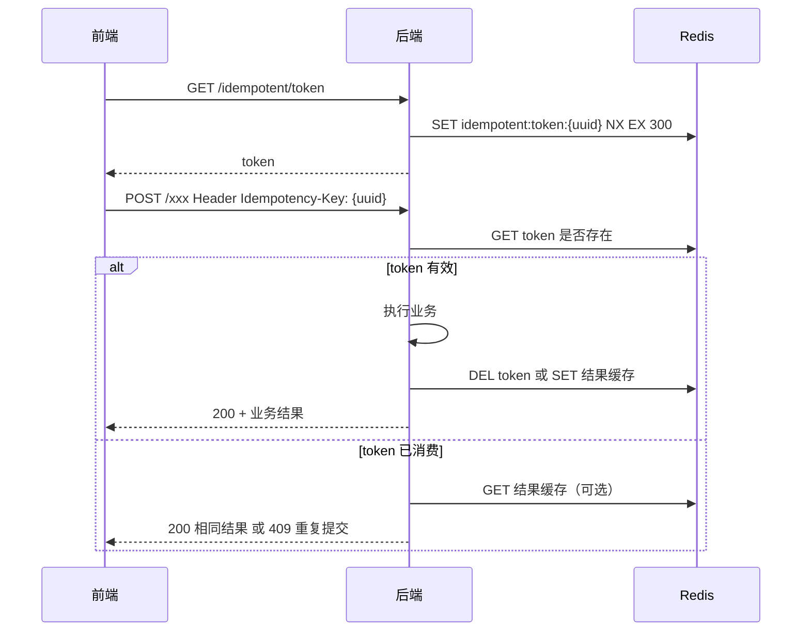

# 接口幂等 + 防重复提交

> 面向本项目 `interview_copilot` 的技术亮点文档（面试可讲 ⭐⭐）。  
> 关联亮点：[数学刷题网站设计与技术亮点](./数学刷题网站设计与技术亮点.md) §6、Redis 缓存互斥锁见 [题目详情Redis缓存方案](./题目详情Redis缓存方案.md)。

---

## 1. 为什么要做

### 1.1 典型故障场景


| 场景      | 用户行为         | 不加防护会怎样                            |
| ------- | ------------ | ---------------------------------- |
| 收藏题目    | 网络慢，连点两次「收藏」 | 插入两条收藏记录（若没唯一键）或抛异常                |
| 批改回填    | 提交整张卷子，前端重试  | `user_question_status` 状态抖动、统计重复累加 |
| 每日签到    | 双击签到按钮       | 重复写 Redis BitSet（本项目已天然幂等）         |
| 组卷 / 导出 | 重复点击「生成试卷」   | 生成多份 `practice_record`、重复扣配额       |
| 批量加题到题库 | 管理员重复提交      | 唯一键冲突、线程池重复跑批                      |


本质问题：**HTTP 请求可能因超时、重试、双击、网关重放而到达服务端不止一次**，而写操作（INSERT / UPDATE / 副作用）默认**不是**安全的。

### 1.2 和「并发安全」的关系

```
并发安全（广义）
├── 多线程同时读写同一资源 → synchronized / Lock / 原子操作
├── 多实例同时处理同一业务 → 分布式锁（Redisson RLock）
└── 同一业务请求被重复提交 → 幂等设计 + 防重复提交（本文重点）
```

- **并发安全**：多个请求**同时**进来，数据不能乱。
- **幂等**：同一个请求（或同一业务语义）执行 **1 次和 N 次，最终效果一样**。
- **防重复提交**：在入口或业务层**拦截**「短时间内重复的写请求」，往往借助 Token / 锁 / 唯一键。

三者常组合使用，面试时可说：**「数据库唯一约束兜底线，业务层 upsert 做语义幂等，入口 Token 防用户误操作，分布式锁防并发竞态。」**

---

## 2. 概念辨析（面试先讲清）

### 2.1 幂等（Idempotent）

> 同一操作执行多次，系统状态与执行一次相同（或等价）。

注意区分两类幂等：


| 类型       | 含义       | 例子                                               |
| -------- | -------- | ------------------------------------------------ |
| **天然幂等** | 多次执行结果不变 | `DELETE` 已删除的行；`SET status=done` 再 SET 一次仍是 done |
| **业务幂等** | 需设计才能保证  | `INSERT` 收藏；`INSERT` 组卷记录                        |


幂等**不保证**「只执行一次」，只保证「执行多次没问题」。

### 2.2 防重复提交（Duplicate Submit Prevention）

> 在请求到达业务逻辑前或过程中，**尽量只让第一次有效**，后续重复请求直接拒绝或返回与第一次相同的结果。

常见触发源：

- 用户双击按钮
- 前端 axios 超时后自动重试
- 移动端弱网重发
- 网关 / 消息队列 **At-Least-Once** 投递

防重复提交是**用户体验 + 系统保护**；幂等是**数据正确性底线**。  
**最佳实践：入口防重减少无效流量，底层幂等防止漏网。**

### 2.3 和「去重」的区别


| 概念            | 关注点             |
| ------------- | --------------- |
| 去重（如批量加题先查差集） | 减少无效写入、降低冲突概率   |
| 幂等            | 即使没去重成功，最终结果仍正确 |
| 防重复提交         | 在更外层挡住重复请求      |


本项目 `QuestionBankQuestion` 批量添加是 **去重 + 唯一键** 的组合，见 [QuestionBankQuestion批量添加-面试复习](./QuestionBankQuestion批量添加-面试复习.md)。

---

## 3. 六种常见手段（选型表）


| 手段                  | 原理                            | 优点           | 缺点                        | 适用场景       |
| ------------------- | ----------------------------- | ------------ | ------------------------- | ---------- |
| **① 数据库唯一约束**       | `(userId, questionId)` UNIQUE | 简单、可靠、跨实例    | 冲突需捕获转业务码；不能防「业务上不同但语义重复」 | 收藏、状态表、关联表 |
| **② Upsert / 先查后写** | 有则 update，无则 insert           | 语义清晰，对外可声明幂等 | 先查后写存在竞态窗口                | 做题状态更新     |
| **③ 数据库 UPSERT 语法** | `ON DUPLICATE KEY UPDATE`     | 原子、无竞态       | SQL 与 ORM 绑定需额外写          | 高并发状态写入    |
| **④ 幂等 Token**      | 提交前领 Token，消费后作废              | 入口挡重复，体验好    | 需 Redis、前后端约定             | 表单提交、支付、组卷 |
| **⑤ 分布式锁**          | `RLock` 同一 key 串行化            | 强一致、可包多步逻辑   | 性能开销、需防死锁                 | 组卷、导出、库存扣减 |
| **⑥ 状态机 / 业务校验**    | 仅允许 `pending → done`          | 贴合领域         | 需精心设计流转                   | 订单、批改流程    |


**选型口诀：**

- 能靠 **唯一键 + 捕获冲突** 解决的，优先用数据库（最便宜、最硬）。
- 需要 **更新已有记录** 的，用 upsert 或 `ON DUPLICATE KEY UPDATE`。
- 需要 **挡用户连点** 的，加 **幂等 Token** 或前端 debounce（前端不能单独依赖）。
- **多步非原子**（查题 + 写记录 + 发消息）才上 **分布式锁** 或 **本地消息表**。

---

## 4. 本项目已有实践（结合代码）

### 4.1 数据库唯一约束（最终兜底）

`create_table.sql` 中多处已设计：

```sql
-- 用户 × 题目：做题状态、收藏 各一条
UNIQUE KEY uk_user_question (userId, questionId)

-- 题库 × 题目、题目 × 知识点
UNIQUE (questionBankId, questionId)
UNIQUE KEY uk_question_kp (questionId, knowledgePointId)
```

**面试话术：**  

> 关联类、用户态类表用联合唯一键做最终一致性兜底；应用层冲突转 `OPERATION_ERROR` 或幂等返回已有 id，避免 500。

### 4.2 收藏：先查 + 唯一键双保险（业务幂等）

`QuestionFavoriteServiceImpl.addFavorite`：

```java
// 1. 先查是否已收藏 → 已存在则直接返回 id（幂等）
QuestionFavorite existing = this.getOne(queryWrapper);
if (existing != null) {
    return existing.getId();
}
// 2. 插入
try {
    this.save(favorite);
} catch (DataIntegrityViolationException e) {
    // 3. 并发下两个请求同时通过「先查」→ 唯一键兜底，再查一次返回
    QuestionFavorite duplicate = this.getOne(queryWrapper);
    return duplicate.getId();
}
```


| 层次     | 作用                           |
| ------ | ---------------------------- |
| 先查后插   | 正常路径避免无意义 INSERT             |
| 唯一键    | 并发双写时只有一个成功                  |
| 捕获冲突再查 | 对调用方仍返回成功 + 同一 id → **对外幂等** |


接口注释已标明：`POST /questionFavorite/add` — **收藏题目（幂等）**。

### 4.3 做题状态：Upsert 语义（每用户每题一条）

`UserQuestionStatusServiceImpl.updateStatus`：

```java
UserQuestionStatus existing = this.getOne(
    userId + questionId 条件查询);
if (existing == null) {
    this.save(record);      // 首次：插入
} else {
    existing.setStatus(...);
    this.updateById(existing);  // 再次：更新同一条
}
```

配合表上 `uk_user_question (userId, questionId)`：

- 同一用户对同一题，无论调用多少次，**只有一行**。
- 重复提交 `status=done, result=correct` → 最终仍是 done + correct（天然幂等）。
- **改进点（可选）：** 高并发下两个线程同时 `existing == null` 可能双插，唯一键会拦一个；可改为 `INSERT ... ON DUPLICATE KEY UPDATE` 或加分布式锁。

接口：`POST /userQuestionStatus/update` — 注释为 **幂等 upsert**。

### 4.4 签到：Redis BitSet 天然幂等

`UserServiceImpl.addUserSignIn`：

```java
if (!bitSet.get(dayOfYear)) {
    bitSet.set(dayOfYear, true);
}
return true;  // 已签到再调也是 true
```

同一天 bit 已为 1，再 set 无副作用 → **天然幂等**，无需 Token。  
注意：若以后要「签到送积分」，应用 **幂等键** `signin:{userId}:{date}` 防积分重复发放。

### 4.5 批量加题到题库：差集去重 + 唯一键

`QuestionBatchAddToQuestionBank` 流程：

1. 查已在库中的 `questionId` → 算差集 `insertQuestionIds`
2. 异步 `saveBatch`
3. `DataIntegrityViolationException` → 业务异常「题目已存在于该题库」

详见 [QuestionBankQuestion批量添加-面试复习](./QuestionBankQuestion批量添加-面试复习.md) §6。

### 4.6 Redisson 分布式锁（当前用途：缓存击穿，非业务防重）

`QuestionCacheServiceImpl` 中：

```java
RLock lock = redissonClient.getLock(lockKey);
locked = lock.tryLock(3, 10, TimeUnit.SECONDS);
```

此处锁的语义是：**同一 `questionId` 缓存 miss 时，只有一个线程查 DB 回填**，属于 [缓存击穿互斥](./题目详情Redis缓存方案.md)，**不是**接口幂等 Token。

面试时要分开讲：


| 锁的 key                          | 目的          |
| ------------------------------- | ----------- |
| `question:detail:lock:{id}`     | 防缓存击穿，保护 DB |
| `idempotent:submit:{token}`（规划） | 防重复提交，保护业务写 |
| `practice:create:{userId}`（规划）  | 组卷创建串行化     |


---

## 5. 典型场景方案设计（含规划）

### 5.1 批改回填（`user_question_status`）✅ 已部分落地

**业务：** 用户离线做完卷子，在 web 上逐题标 `done` + `correct/wrong`。


| 风险             | 方案                                          |
| -------------- | ------------------------------------------- |
| 同一题重复提交状态      | 表唯一键 + upsert（已实现）                          |
| 整张卷子批量提交部分失败重试 | 请求带 `batchId`；每题以 `(userId, questionId)` 幂等 |
| 前端连点「全部标为已对」   | 幂等 Token 或按钮 loading + 禁用                   |


**推荐接口形态：**

```json
POST /userQuestionStatus/update
{
  "questionId": 1001,
  "status": "done",
  "result": "correct"
}
```

重复调用：返回 200，状态不变 → 满足幂等。

### 5.2 收藏 ❤️ ✅ 已落地

见 §4.2，可作为项目里**讲幂等最顺的代码**。

### 5.3 每日签到 ✅ 已落地

见 §4.4；扩展积分时要加 **业务幂等键**，不能仅靠 BitSet。

### 5.4 组卷 / 导出（`practice_record`，后续）

**风险：** 用户连点「生成练习卷」→ 多条记录、重复导出任务。

**推荐分层：**

```
前端 debounce + 按钮禁用
    ↓
POST /practice/create  Header: Idempotency-Key: <uuid>   ← 入口防重
    ↓
RLock("practice:create:" + userId)  短时持锁             ← 并发串行（可选）
    ↓
INSERT practice_record + 唯一业务号 requestNo            ← 库内幂等
    ↓
异步导出任务（MQ / 线程池），任务 id 与 record 绑定
```

### 5.5 表单类写操作（题目新增、批量导入）

管理员 **批量导入 Excel**：用 `importBatchId` + Redis `SETNX import:batch:{id}`，同一批次只处理一次；失败可凭 batchId 查结果，不重复入库。

---

## 6. 幂等 Token 方案（推荐落地模板）

适合：**组卷、支付式提交、任何「点一次就不能再点」的写接口**。

### 6.1 流程




### 6.2 Key 设计

```
idempotent:token:{uuid}           → 待消费，TTL 5min
idempotent:result:{uuid}          → 首次执行结果 JSON，TTL 24h（供重试拿相同响应）
idempotent:user:{userId}:{api}    → 可选，限制同一用户同一接口频率
```

### 6.3 与 JWT 用户绑定

Token 生成时写入 `userId`，消费时校验 **Token 所属用户 = 当前登录用户**，防止 Token 被盗用。

### 6.4 伪代码（AOP 或拦截器）

```java
@Around("@annotation(Idempotent)")
public Object around(ProceedingJoinPoint pjp, Idempotent ann) {
    String key = request.getHeader("Idempotency-Key");
    ThrowUtils.throwIf(StrUtil.isBlank(key), ErrorCode.PARAMS_ERROR, "缺少幂等键");

    String tokenKey = "idempotent:token:" + key;
    String resultKey = "idempotent:result:" + key;

    // 已处理过 → 直接返回缓存结果
    String cached = bucket(resultKey).get();
    if (cached != null) {
        return JSONUtil.parse(cached);
    }

    // 尝试消费 token（原子删除表示抢占成功）
    boolean acquired = redissonClient.getBucket(tokenKey).delete();
    if (!acquired) {
        throw new BusinessException(ErrorCode.OPERATION_ERROR, "请勿重复提交");
    }

    Object result = pjp.proceed();
    bucket(resultKey).set(JSONUtil.toJsonStr(result), 24, HOURS);
    return result;
}
```

---

## 7. 分布式锁用于业务防重（何时用、何时不用）

### 7.1 适用

- 逻辑跨多表、多 RPC，**无法**用单行唯一键表达。
- 需要 **read-modify-write** 原子性（如组卷算法：读候选集 → 抽题 → 写 record）。
- 库存、名额、导出任务并发上限。

### 7.2 不适用

- 单纯 `INSERT` 且已有唯一键 → 锁是多余开销。
- 读多写少的缓存回填 → 用 `tryLock` 互斥即可（已实现）。

### 7.3 写法要点

```java
RLock lock = redissonClient.getLock("lock:practice:create:" + userId);
boolean locked = false;
try {
    locked = lock.tryLock(0, 30, TimeUnit.SECONDS);  // 不等待，防重复点击
    if (!locked) {
        throw new BusinessException(ErrorCode.OPERATION_ERROR, "操作进行中，请勿重复提交");
    }
    // 业务逻辑
} finally {
    if (locked) {
        lock.unlock();
    }
}
```

与缓存锁的区别：


| 参数       | 缓存击穿锁         | 业务防重锁        |
| -------- | ------------- | ------------ |
| waitTime | 3s（愿等等同伴写完缓存） | 0s（重复请求直接拒绝） |
| 失败处理     | 递归读缓存         | 返回「请勿重复提交」   |


---

## 8. 分层防护模型（面试一张图讲完）

```
┌─────────────────────────────────────────────────────────┐
│ L1 前端：防抖 / 按钮 loading / 禁用二次点击                  │
├─────────────────────────────────────────────────────────┤
│ L2 网关：同一用户写接口限流（可选）                          │
├─────────────────────────────────────────────────────────┤
│ L3 幂等 Token：Idempotency-Key 一次性消费                  │
├─────────────────────────────────────────────────────────┤
│ L4 分布式锁：多步写操作串行（组卷、导出）                     │
├─────────────────────────────────────────────────────────┤
│ L5 业务逻辑：先查后写 / upsert / 状态机                      │
├─────────────────────────────────────────────────────────┤
│ L6 数据库：UNIQUE 约束 + 事务                               │
└─────────────────────────────────────────────────────────┘
```

**本项目当前覆盖：**


| 层级  | 状态                  | 代表                                   |
| --- | ------------------- | ------------------------------------ |
| L5  | ✅                   | 收藏先查、状态 upsert                       |
| L6  | ✅                   | 各表 UNIQUE                            |
| L4  | ⚠️ 缓存场景已有，业务防重待组卷落地 | `QuestionCacheServiceImpl`           |
| L3  | ❌ 待落地               | 组卷 / 导出                              |
| L1  | 前端文档已约定             | [客户网页端前端设计文档](./客户网页端前端设计文档.md) 收藏幂等 |


---

## 9. 和事务、消息队列的配合

### 9.1 本地事务 + 唯一键

收藏、状态更新：**单库事务 + 唯一键** 足够，无需 MQ。

### 9.2 异步任务（导出 PDF）

```
创建 practice_record（同步，幂等）
    → 发 MQ 消息（messageId 幂等）
    → 消费者处理导出（消费幂等：record.status != PENDING 则 skip）
```

MQ 消费端常用：**业务唯一键 + Redis SETNX** 或 **数据库乐观锁 version**。

### 9.3 「先查后写」竞态

两个线程同时查到 `existing == null`，会双插：

```
线程 A: SELECT → null
线程 B: SELECT → null
线程 A: INSERT → 成功
线程 B: INSERT → 唯一键冲突 → 需 catch 后改 UPDATE 或返回成功
```

收藏模块已用 `catch DataIntegrityViolationException` 处理；状态表建议同样处理或改 `ON DUPLICATE KEY UPDATE`。

---

## 10. 面试问答速查

### Q1：幂等和防重复提交有什么区别？

**答：** 幂等强调**多次执行的最终结果一致**，是数据正确性要求；防重复提交强调**尽量减少重复请求进入核心逻辑**，是体验和流量层面的防护。生产上两者一起做：入口 Token 防连点，底层唯一键防漏网。

### Q2：你们项目里哪里做了幂等？

**答：** 收藏 `addFavorite` 先查 + 唯一键冲突兜底；做题状态 `updateStatus` 按 userId+questionId upsert；签到 BitSet 同一天重复 set 无副作用；题库批量加题先差集去重再 insert，唯一键最终兜底。

### Q3：为什么收藏不只用唯一键，还要先查？

**答：** 先查让正常路径不走异常，减少无效 INSERT 和异常栈；唯一键处理并发双写；冲突后再查返回已有 id，对前端仍是成功——三层各管一段。

### Q4：分布式锁和唯一键怎么选？

**答：** 单表插入能靠联合唯一键表达的，优先唯一键。多步逻辑（组卷抽题+写记录+发任务）或 read-modify-write 跨多行，用锁或 DB 乐观锁。缓存击穿用短锁保护回填，和业务防重锁的 waitTime、失败策略不同。

### Q5：幂等 Token 为什么要删 Token 而不是 GET 判断？

**答：** GET 再执行业务不是原子的，两个请求可能都 GET 成功。应用 **DELETE 或 SETNX** 做一次性抢占，保证只有一个请求进入业务；结果可缓存供重试返回相同响应。

### Q6：接口返回 200 还是 409？

**答：** 严格幂等接口（支付、收藏）重复提交宜 **200 + 相同结果**；明确拒绝重复的可 **409** 或业务码「请勿重复提交」。前后端需约定。

---

## 11. 落地待办（按优先级）


| 优先级 | 内容                                         | 说明                   |
| --- | ------------------------------------------ | -------------------- |
| P0  | `user_question_status` 双插冲突 catch          | 与收藏对齐，唯一键冲突时改 update |
| P1  | 通用 `@Idempotent` + Token 接口                | 组卷、导出前置              |
| P1  | 组卷 `practice_record` 表加 `requestNo` UNIQUE | 库内幂等                 |
| P2  | 签到若接积分，加 `signin:reward:{userId}:{date}`   | 防重复发奖                |
| P2  | 管理端批量导入 batchId 幂等                         | 防重复导入                |


---

## 12. 相关文档与代码索引


| 文档 / 代码                                                             | 内容           |
| ------------------------------------------------------------------- | ------------ |
| [数学刷题网站设计与技术亮点](./数学刷题网站设计与技术亮点.md)                                 | 亮点总览 §6 并发安全 |
| [Controller接口改造清单](./Controller接口改造清单.md)                           | 各接口幂等约定      |
| [QuestionBankQuestion批量添加-面试复习](./QuestionBankQuestion批量添加-面试复习.md) | 批量入库幂等       |
| [题目详情Redis缓存方案](./题目详情Redis缓存方案.md)                                 | RLock 防缓存击穿  |
| `QuestionFavoriteServiceImpl.addFavorite`                           | 收藏幂等样板       |
| `UserQuestionStatusServiceImpl.updateStatus`                        | 状态 upsert    |
| `UserServiceImpl.addUserSignIn`                                     | BitSet 天然幂等  |
| `QuestionCacheServiceImpl.getFromCache`                             | 分布式锁（缓存场景）   |


---

## 13. 一句话总结（背这句）

> **防重复提交在入口用 Token 和前端交互解决「连点」；幂等在数据层用唯一约束和 upsert 保证「重试也正确」；多步写操作用 Redisson 锁串行化；缓存击穿和业务防重是两种不同语义的锁，不要混讲。**

