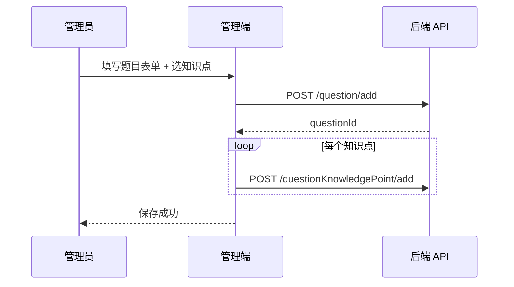
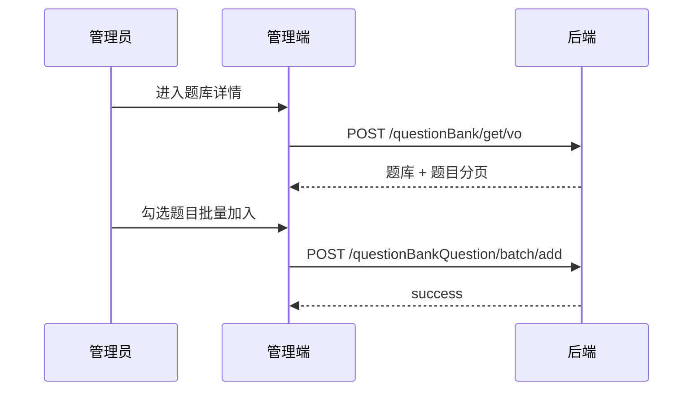
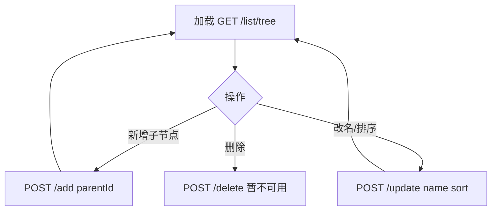

# 数学刷题平台 —— 管理端（B 端）前端设计文档

> 基于当前后端代码（Spring Boot 2.7 + JWT + MyBatis-Plus）整理，供管理端 Web 前端开发与联调使用。  
> 文档版本：v1.0 · 更新日期：2026-06-03

---

## 1. 文档说明

| 项 | 内容 |
|----|------|
| 文档名称 | 管理端前端设计文档 |
| 适用读者 | 前端开发、UI 设计、后端联调、测试 |
| 产品范围 | **B 端管理后台**（题目/知识点/题库/用户/关联管理） |
| 不包含 | C 端刷题页、收藏、做题状态、组卷导出（后续独立文档） |
| 后端基址 | `http://{host}:8101/api` |
| 接口文档 | `http://{host}:8101/api/doc.html`（Knife4j） |

---

## 2. 项目背景与目标

### 2.1 背景

后端已由「面试题库 Copilot」改造为**数学刷题平台**，核心变化：

- 题目模型：去 `title`，增加 `questionType`、`difficulty`、`options`、`analysis`、`source`、`picture`，题干/答案/解析支持 **LaTeX**
- 新增**知识点树**（`knowledge_point`）及题目-知识点关联（`question_knowledge_point`）
- 题库（`question_bank`）复用为「练习集 / 专题卷」
- 用户做题状态、收藏为 C 端能力，管理端暂不纳入主菜单

### 2.2 管理端目标

1. 管理员可高效维护：**知识点目录 → 题目 → 知识点绑定 → 题库编排**
2. 支持 LaTeX 题干的录入、预览与管理
3. 与现有 REST API **一一对应**，减少前端自造字段
4. 为后续「批量导入 Excel」「数据看板」预留菜单位

### 2.3 成功标准（MVP）

- 管理员登录后可完成全链路 CRUD（除后端未实现项见 §12）
- 题目列表可按题型/难度/来源筛选
- 知识点树可视化维护（增删改查，删除受后端限制）
- 题库可创建、编辑、批量加入/移除题目

---

## 3. 角色与权限

### 3.1 角色定义（与后端一致）

| 角色值 | 说明 | 管理端 |
|--------|------|--------|
| `admin` | 管理员 | ✅ 可进入管理端 |
| `user` | 普通用户 | ❌ 跳转无权限页 |
| `ban` | 封禁 | ❌ 所有需登录接口返回 40101 |

### 3.2 鉴权机制

```
登录 POST /user/login
  → 响应 LoginUserVO.token
  → 前端持久化（localStorage / sessionStorage）

后续请求 Header:
  token: {jwt}

全局拦截器：除 /user/login、/user/register 外，所有 /api/** 需有效 token

管理员接口额外要求：
  后端 @AuthCheck(mustRole = "admin")
  非 admin → code: 40101 无权限
```

### 3.3 管理端路由守卫

| 检查项 | 规则 |
|--------|------|
| 未登录 | 跳转 `/login` |
| 已登录非 admin | 跳转 `/403` |
| token 过期 | 40100 → 清 token，回登录 |
| 40101 | 提示无权限 |

### 3.4 接口权限矩阵（管理端相关）

| 模块 | 接口 | 需 admin |
|------|------|----------|
| 用户管理 | `/user/add` `/delete` `/update` `/get` `/list/page` | ✅ |
| 题目 | `/question/list/page` | ✅ |
| 题目 | `/question/add` `/update` `/delete` | ⚠️ 当前**无** admin 校验，建议管理端仍只用 admin 账号 |
| 知识点 | `/knowledgePoint/add` `/update` `/delete` | ✅ |
| 题目-知识点 | `/questionKnowledgePoint/**`（除按知识点查题） | ✅ |
| 题库 | `/questionBank/add` `/update` `/delete` `/list/page` | ✅ |
| 题库-题目 | `/questionBankQuestion/**` | ✅ |
| 文件上传 | `/file/upload` | 登录即可 |

---

## 4. 技术选型建议

| 层级 | 推荐 | 说明 |
|------|------|------|
| 框架 | Vue 3 + TypeScript 或 React 18 | 与团队栈一致即可 |
| UI | Ant Design Vue / Arco Design / Ant Design | 表格、树、表单成熟 |
| 路由 | Vue Router / React Router | 路由守卫做 admin 校验 |
| 请求 | Axios | 统一封装 BaseResponse |
| 状态 | Pinia / Zustand | 存 userInfo、token、知识点树缓存 |
| LaTeX | KaTeX + 编辑器（如 @wangeditor 或 CodeMirror） | 题目录入预览 |
| 构建 | Vite | 开发与打包 |

---

## 5. 全局规范

### 5.1 统一响应结构

```typescript
interface BaseResponse<T> {
  code: number;    // 0 成功
  data: T;
  message: string;
}
```

| code | 含义 | 前端处理 |
|------|------|----------|
| 0 | 成功 | 正常取 `data` |
| 40000 | 参数错误 | 表单提示 `message` |
| 40100 | 未登录 | 跳转登录 |
| 40101 | 无权限 | 403 页 |
| 40400 | 不存在 | 空态 / Toast |
| 50001 | 操作失败 | Toast |

### 5.2 分页约定

所有列表请求体继承：

```typescript
interface PageRequest {
  current: number;   // 默认 1
  pageSize: number;  // 默认 10，后端部分接口限制 < 20
  sortField?: string;
  sortOrder?: 'ascend' | 'descend'; // 后端用 asc / desc，需映射
}
```

分页响应（MyBatis-Plus Page）：

```typescript
interface Page<T> {
  records: T[];
  total: number;
  size: number;
  current: number;
}
```

### 5.3 删除约定

统一使用：

```json
POST /xxx/delete
{ "id": 123 }
```

题目-知识点批量解绑等使用专用 DTO（见各模块）。

### 5.4 日期与字段命名

后端 **未开启** 驼峰下划线转换（`map-underscore-to-camel-case: false`），JSON 字段为：

- `userId`、`questionId`、`createTime`、`questionType` 等 **camelCase**

前端 TypeScript 类型与后端保持一致，勿擅自转 snake_case。

---

## 6. 信息架构与路由

### 6.1 站点地图

```
管理端
├── /login                    登录
├── /403                      无权限
├── /                         仪表盘（可选，MVP 可省略）
├── /user/list                用户管理
├── /knowledge-point          知识点管理（树形）
├── /question/list            题目管理
├── /question/create          新建题目
├── /question/edit/:id        编辑题目
├── /question-knowledge       题目-知识点关联（可选独立页，或合并在题目编辑）
├── /question-bank/list       题库管理
├── /question-bank/detail/:id 题库详情 & 题目编排
└── /question-bank-question   关联关系查询（可选，高级调试）
```

### 6.2 路由表

| 路径 | 页面 | 菜单名 |
|------|------|--------|
| `/login` | 登录页 | — |
| `/user/list` | 用户列表 | 用户管理 |
| `/knowledge-point` | 知识点树 | 知识点 |
| `/question/list` | 题目列表 | 题目管理 |
| `/question/create` | 新建题目 | — |
| `/question/edit/:id` | 编辑题目 | — |
| `/question-bank/list` | 题库列表 | 题库管理 |
| `/question-bank/detail/:id` | 题库详情 | — |

### 6.3 布局结构

```
┌─────────────────────────────────────────────────────┐
│  Logo   数学刷题管理后台          管理员昵称  [退出]     │
├──────────┬──────────────────────────────────────────┤
│ 侧边菜单  │  面包屑                                   │
│          │  ┌────────────────────────────────────┐  │
│ 用户管理  │  │         主内容区（表格/表单/树）      │  │
│ 知识点    │  └────────────────────────────────────┘  │
│ 题目管理  │                                          │
│ 题库管理  │                                          │
└──────────┴──────────────────────────────────────────┘
```

---

## 7. 页面详细设计

### 7.1 登录页 `/login`

**功能**：管理员账号登录，非 admin 拒绝进入后台。

| 表单项 | 字段 | 校验 |
|--------|------|------|
| 账号 | `userAccount` | 必填，≥4 字符 |
| 密码 | `userPassword` | 必填，≥8 字符 |

**API**：`POST /user/login`

**响应关键字段**：`LoginUserVO.token`、`userRole`

**交互**：

1. 登录成功且 `userRole === 'admin'` → 存 token + 用户信息 → `/question/list` 或 `/`
2. `userRole === 'user'` → 提示「请使用管理员账号」
3. 失败展示 `message`

---

### 7.2 用户管理 `/user/list`

**功能**：管理员对用户 CRUD。

#### 列表区

| 列 | 字段 | 说明 |
|----|------|------|
| ID | `id` | |
| 账号 | `userAccount` | |
| 昵称 | `userName` | |
| 角色 | `userRole` | Tag：admin/user/ban |
| 创建时间 | `createTime` | |

**查询**：`POST /user/list/page`

```json
{
  "current": 1,
  "pageSize": 10,
  "userName": "",
  "userRole": "user"
}
```

#### 新建用户（Modal / Drawer）

**API**：`POST /user/add`（admin）

| 字段 | 类型 | 说明 |
|------|------|------|
| userAccount | string | 必填 |
| userName | string | |
| userAvatar | string | URL，可先走上传 |
| userRole | select | user / admin |

默认密码后端设为 `12345678`（见 `UserServiceImpl.addUser`）。

#### 编辑 / 删除

- 更新：`POST /user/update` `{ id, userName, userRole, userAvatar, ... }`
- 删除：`POST /user/delete` `{ id }`

---

### 7.3 知识点管理 `/knowledge-point`

**功能**：维护目录树，供题目归类与 C 端导航使用。

#### 布局（推荐左右分栏）

```
┌─────────────────┬──────────────────────────────┐
│  Tree 目录       │  节点详情 / 编辑表单             │
│  [+ 根节点]      │  名称、排序、ID、path、level    │
│  ├ 高中数学      │  [保存] [删除]                  │
│  │ ├ 代数       │                              │
│  │ └ 几何       │                              │
└─────────────────┴──────────────────────────────┘
```

#### 树数据

**API**：`GET /knowledgePoint/list/tree`

**结构**：

```typescript
interface KnowledgePointVO {
  id: number;
  parentId: number;
  name: string;
  path: string;
  level: number;
  sort: number;
  children?: KnowledgePointVO[];
}
```

多根节点（如「高中数学」「初中数学」）为数组顶层项。

**缓存建议**：进入页面拉一次全树，编辑成功后 `refreshTree()`。

#### 新增节点

**API**：`POST /knowledgePoint/add`（admin）

| 字段 | 说明 |
|------|------|
| parentId | 根节点传 `0`；子节点传父 id |
| name | 必填 |
| sort | 可选，默认 0 |

后端自动维护 `path`、`level`（先 insert 再回写 path）。

#### 编辑节点

**API**：`POST /knowledgePoint/update`（admin）

| 字段 | MVP 建议 |
|------|----------|
| id | 必填 |
| name | 可改 |
| sort | 可改 |
| parentId | **前端暂不开放**（后端移动未实现 path 级联） |

#### 删除节点

**API**：`POST /knowledgePoint/delete` `{ id }`

⚠️ **后端当前未实现** `removeKnowledgePointRecursively`，调用会失败。前端可先隐藏删除或灰显 + Tooltip「后端开发中」。

#### 分页列表（备选）

管理端若需表格检索：`POST /knowledgePoint/list/page`，支持 `name`、`parentId`、`path`、`level` 筛选。

---

### 7.4 题目管理 `/question/list`

**功能**：题目 CRUD、筛选、跳转编辑。

#### 筛选区

| 筛选项 | 请求字段 | 组件 |
|--------|----------|------|
| 关键词 | `searchText` | Input（搜 content/answer） |
| 题型 | `questionType` | Select |
| 难度 | `difficulty` | Select 1-5 |
| 来源 | `source` | Input |
| 创建者 | `userId` | 可选 |

#### 列表列

| 列 | 字段 |
|----|------|
| ID | `id` |
| 题干摘要 | `content` | 截断 + LaTeX 预览 Tooltip |
| 题型 | `questionType` | 枚举中文 |
| 难度 | `difficulty` | 1-5 星或 Tag |
| 来源 | `source` |
| 创建者 | `userVO.userName` |
| 更新时间 | `updateTime` |
| 操作 | 编辑 / 删除 |

**API**：

- 管理列表（原始实体）：`POST /question/list/page`（admin）
- 或 VO 列表：`POST /question/list/page/vo`（登录即可，字段更全）

#### 操作

- 新建 → `/question/create`
- 编辑 → `/question/edit/:id`
- 删除 → `POST /question/delete` `{ id }`（逻辑删除）

---

### 7.5 题目新建/编辑 `/question/create` · `/question/edit/:id`

**功能**：录入数学题，绑定知识点，LaTeX 预览。

#### 表单字段（对齐 `QuestionAddRequest` / `QuestionUpdateRequest`）

| 字段 | 组件 | 校验（对齐后端） |
|------|------|------------------|
| content | LaTeX 编辑器 + 预览 | 新建必填 |
| questionType | Select | 必填，见枚举 |
| difficulty | Rate / Select | 1-5 必填 |
| options | JSON 编辑器 | single/multiple 必填 |
| answer | LaTeX / Input | 新建必填 |
| analysis | LaTeX 编辑器 | 可选 |
| source | Input | 可选 |
| picture | 图片 URL Input + 上传 | 可选 |

**题型枚举**：

| value | 展示 |
|-------|------|
| single | 单选 |
| multiple | 多选 |
| judge | 判断 |
| blank | 填空 |
| subjective | 解答 |

**options JSON 格式**（与种子数据一致）：

```json
[
  {"key":"A","content":"$x^2+1=0$"},
  {"key":"B","content":"$x^2-4x+4=0$"}
]
```

客观题表单建议：动态选项列表 → 序列化为 JSON 字符串提交。

#### 知识点绑定（重要）

⚠️ 当前 `QuestionAddRequest` **不含** `knowledgePointIds`，题目保存与知识点绑定为**两步**：

1. `POST /question/add` 或 `/question/update` → 得到 `questionId`
2. 绑定知识点：
   - 单条：`POST /questionKnowledgePoint/add` `{ questionId, knowledgePointId }`
   - 批量：`POST /questionKnowledgePoint/batch/add` `{ knowledgePointId, questionIdList }`

**编辑页推荐 UI**：

- 多选 TreeSelect，数据源 `GET /knowledgePoint/list/tree`
- 保存时：先更新题目 → 再调用后端 `replaceQuestionKnowledgePoints`（**Service 已有，Controller 未暴露**）
- **MVP 联调方案**：
  - 先 `batch/delete` 解绑旧关联（需知关联 id 或按 questionId 批量删，当前仅支持按 knowledgePointId+questionIdList 删）
  - 再 `batch/add` 重新绑定  
  - 或管理端题目编辑页单独做「关联管理」子表格，走 `/questionKnowledgePoint/list/page?questionId=`

#### 详情加载

**API**：`GET /question/get/vo?id=`

#### 提交

- 新建：`POST /question/add`
- 更新：`POST /question/update`（带 `id`）

---

### 7.6 题目-知识点关联（可选页 `/question-knowledge`）

**功能**：运维排查、批量维护绑定。

| 操作 | API |
|------|-----|
| 分页查询 | `POST /questionKnowledgePoint/list/page` |
| 单条绑定 | `POST /questionKnowledgePoint/add` |
| 删除 | `POST /questionKnowledgePoint/delete` `{ id }` 关联表主键 |
| 批量绑定 | `POST /questionKnowledgePoint/batch/add` |
| 批量解绑 | `POST /questionKnowledgePoint/batch/delete` |

列表列：`id`、`questionId`、`knowledgePointId`、`userId`、`createTime`

---

### 7.7 题库管理 `/question-bank/list`

**功能**：练习集 / 专题卷的 CRUD。

#### 列表

**API**：`POST /questionBank/list/page`（admin）或 `/list/page/vo`

| 列 | 字段 |
|----|------|
| ID | `id` |
| 标题 | `title` |
| 描述 | `description` |
| 封面 | `picture` |
| 创建者 | `user.userName` |
| 操作 | 详情 / 编辑 / 删除 |

#### 新建/编辑

| 字段 | 说明 |
|------|------|
| title | 必填（add 时） |
| description | |
| picture | URL |

- 新增：`POST /questionBank/add`
- 更新：`POST /questionBank/update`
- 删除：`POST /questionBank/delete`

---

### 7.8 题库详情 `/question-bank/detail/:id`

**功能**：查看题库内题目，批量加入/移除。

#### 题库信息

**API**：`POST /questionBank/get/vo`

```json
{
  "id": 1,
  "current": 1,
  "pageSize": 10
}
```

**响应**：`QuestionBankVO` + `questionPage`（内嵌题目分页，实体为 `Question` 非 VO）

#### 题目列表区

展示 `questionPage.records`：content 摘要、questionType、difficulty。

#### 批量加入题目

1. Modal：题目多选（数据来自 `POST /question/list/page/vo` 筛选）
2. 提交：`POST /questionBankQuestion/batch/add`

```json
{
  "questionBankId": 1,
  "questionIdList": [1, 2, 3]
}
```

#### 批量移除

`POST /questionBankQuestion/batch/delete`

```json
{
  "questionBankId": 1,
  "questionIdList": [2, 3]
}
```

#### 关联关系调试（可选）

`POST /questionBankQuestion/list/page` 查原始关联表。

---

### 7.9 文件上传（通用能力）

**API**：`POST /file/upload`（multipart）

| 参数 | 说明 |
|------|------|
| file | 文件 |
| biz | 业务类型，当前仅 `user_avatar` |

⚠️ 题目配图 `picture` 字段目前**无** `question_picture` 上传 biz，MVP 可：

- 手填 COS URL，或
- 扩展后端 `FileUploadBizEnum` 后再接上传组件

---

## 8. 核心业务流程

### 8.1 新题入库流程



### 8.2 题库组卷流程



### 8.3 知识点维护流程



---

## 9. 组件设计

### 9.1 全局组件

| 组件 | 职责 |
|------|------|
| `AppLayout` | 侧栏 + 顶栏 + 内容区 |
| `AdminRouteGuard` | admin 路由守卫 |
| `RequestClient` | Axios 封装、token、错误码 |
| `LatexPreview` | KaTeX 渲染 content/answer/analysis |
| `QuestionTypeTag` | 题型枚举 → 中文 Tag |
| `DifficultyRate` | 1-5 难度展示 |

### 9.2 业务组件

| 组件 | 用途 |
|------|------|
| `KnowledgePointTree` | 树展示 + 选中节点 |
| `KnowledgePointTreeSelect` | 题目表单多选知识点 |
| `QuestionOptionsEditor` | 客观题选项 JSON 编辑 |
| `QuestionForm` | 题目新建/编辑表单 |
| `QuestionPickerModal` | 题库详情里选题 |
| `PageTable` | 统一分页表格 |

---

## 10. 状态管理建议

```typescript
// authStore
{
  token: string;
  loginUser: LoginUserVO | null;
  isAdmin: boolean;
}

// knowledgePointStore（可选）
{
  tree: KnowledgePointVO[];
  lastFetchTime: number;
  loadTree(): Promise<void>;
}
```

知识点树变更不频繁，建议 **session 缓存 30min**，增删改后强制刷新。

---

## 11. 表单校验清单（与后端对齐）

### 题目

| 规则 | 说明 |
|------|------|
| questionType | 必须为五种之一 |
| difficulty | 1-5 |
| single/multiple | options 非空 |
| 新建 | content、answer 非空 |
| 各文本字段 | 长度 ≤ 10240 |

### 知识点

| 规则 | 说明 |
|------|------|
| name | 非空，≤128 字 |
| sort | ≥0 |

### 题库

| 规则 | 说明 |
|------|------|
| title | 新增必填，≤80 字 |
| description | ≤100000 字 |

---

## 12. 后端能力缺口与前端应对

| 项 | 现状 | 前端应对 |
|----|------|----------|
| 知识点删除 | Service 未实现 | 隐藏/禁用删除按钮 |
| 知识点移动 parentId | 无 path 级联 | 编辑页不开放改父节点 |
| 题目一次保存含知识点 | add/update 未集成 | 分步调用 questionKnowledgePoint |
| replaceQuestionKnowledgePoints | 仅 Service | 编辑页多步 batch 或等后端补接口 |
| ES 搜索 | 已关闭 | 管理端只用 MySQL 列表 searchText |
| 题目 CRUD 无 admin 注解 | 任何登录用户可调 | 管理端仅 admin 登录，后续后端加固 |
| 配图上传 biz | 仅 user_avatar | 手填 URL 或扩展后端 |
| 批量导入 Excel | 未实现 | 菜单预留，V2 做 |

---

## 13. 开发优先级

| 阶段 | 内容 | 优先级 |
|------|------|--------|
| P0 | 登录 + 布局 + 路由守卫 | 必须 |
| P0 | 题目列表/新建/编辑/删除 + LaTeX 预览 | 必须 |
| P0 | 知识点树 CRUD（删除外） | 必须 |
| P0 | 题目-知识点绑定 UI | 必须 |
| P0 | 题库 CRUD + 详情 + 批量加题 | 必须 |
| P1 | 用户管理 | 推荐 |
| P1 | 关联关系独立查询页 | 可选 |
| P2 | 仪表盘统计 | 可选 |
| P2 | Excel 批量导入 | 等后端 |

---

## 14. API 速查表（管理端）

基址：`/api`

| 方法 | 路径 | 说明 | Admin |
|------|------|------|-------|
| POST | /user/login | 登录 | — |
| GET | /user/get/login | 当前用户 | — |
| POST | /user/list/page | 用户分页 | ✅ |
| POST | /user/add | 新增用户 | ✅ |
| POST | /user/update | 更新用户 | ✅ |
| POST | /user/delete | 删除用户 | ✅ |
| GET | /knowledgePoint/list/tree | 知识点树 | — |
| POST | /knowledgePoint/list/page | 知识点分页 | — |
| POST | /knowledgePoint/add | 新增知识点 | ✅ |
| POST | /knowledgePoint/update | 更新知识点 | ✅ |
| POST | /knowledgePoint/delete | 删除知识点 | ✅ |
| POST | /question/list/page | 题目分页实体 | ✅ |
| POST | /question/list/page/vo | 题目分页 VO | — |
| GET | /question/get/vo | 题目详情 | — |
| POST | /question/add | 新增题目 | — |
| POST | /question/update | 更新题目 | — |
| POST | /question/delete | 删除题目 | — |
| POST | /questionKnowledgePoint/list/page | 关联分页 | ✅ |
| POST | /questionKnowledgePoint/add | 绑定 | ✅ |
| POST | /questionKnowledgePoint/delete | 解绑 | ✅ |
| POST | /questionKnowledgePoint/batch/add | 批量绑定 | ✅ |
| POST | /questionKnowledgePoint/batch/delete | 批量解绑 | ✅ |
| POST | /questionBank/list/page | 题库分页 | ✅ |
| POST | /questionBank/list/page/vo | 题库 VO 分页 | — |
| POST | /questionBank/get/vo | 题库详情 | — |
| POST | /questionBank/add | 新增题库 | ✅ |
| POST | /questionBank/update | 更新题库 | ✅ |
| POST | /questionBank/delete | 删除题库 | ✅ |
| POST | /questionBankQuestion/list/page | 关联分页 | ✅ |
| POST | /questionBankQuestion/batch/add | 批量加题 | ✅ |
| POST | /questionBankQuestion/batch/delete | 批量移除 | ✅ |
| POST | /file/upload | 文件上传 | — |

---

## 15. 附录

### 15.1 题目实体字段（QuestionVO）

| 字段 | 类型 | 说明 |
|------|------|------|
| id | number | |
| content | string | LaTeX 题干 |
| questionType | string | 题型枚举值 |
| difficulty | number | 1-5 |
| options | string | JSON 字符串 |
| answer | string | |
| analysis | string | |
| source | string | |
| picture | string | URL |
| userId | number | |
| userVO | object | 创建者 |
| createTime | string | |
| updateTime | string | |

### 15.2 分页请求示例

```json
POST /api/question/list/page/vo
Header: token: eyJ...

{
  "current": 1,
  "pageSize": 10,
  "questionType": "single",
  "difficulty": 3,
  "searchText": "二次函数"
}
```

### 15.3 相关后端文档

- [Controller接口改造清单](./Controller接口改造清单.md)
- [知识点相关改造进度](./知识点相关改造进度.md)
- [数学刷题网站设计与技术亮点](./数学刷题网站设计与技术亮点.md)
- [Question改造进度](./Question改造进度.md)

---

## 16. 修订记录

| 版本 | 日期 | 说明 |
|------|------|------|
| v1.0 | 2026-06-03 | 初版，基于当前后端 Controller/Entity 整理 |
