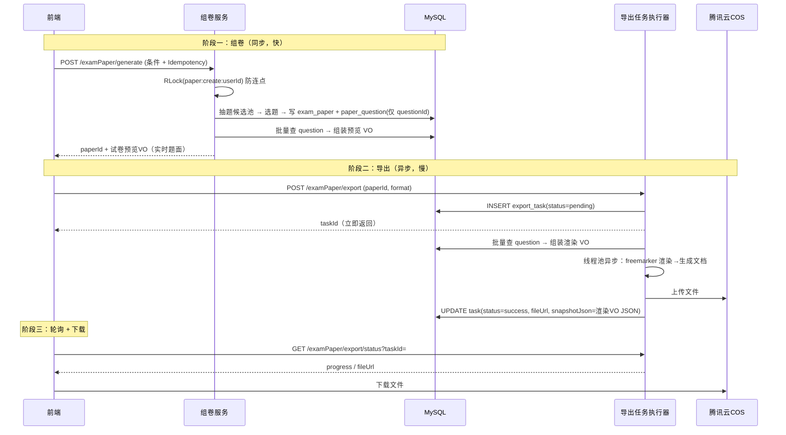

# 组卷与导出功能设计

> 面向本项目 `interview_copilot`（Spring Boot 2.7.2 / Java 8 / MyBatis-Plus / Redisson / COS）的落地设计文档。  
> 业务定位见 [数学刷题网站设计与技术亮点](./数学刷题网站设计与技术亮点.md) §三「组卷 → 导出 → 离线作答 → 回填批改」；并发与幂等见 [接口幂等与防重复提交](./接口幂等与防重复提交.md)。  
> 关联前端预留见 [客户网页端前端设计文档](./客户网页端前端设计文档.md) §12。

---

## 1. 功能目标与边界

### 1.1 一句话定义

> **用户（或管理员）按知识点 / 难度 / 题型 / 数量等条件，从题库中抽题组成一份「试卷」，然后把试卷导出为 PDF / Word 文档下载，用于离线纸笔作答。**

### 1.2 核心诉求


| 诉求     | 说明                      |
| ------ | ----------------------- |
| 灵活组卷   | 手动选题、按知识点专项、随机/智能抽题     |
| 题面一致性  | **方案 C**：平时引用题库最新题面；**仅导出成功时**在 `export_task` 定格 JSON，已下载文件与留档一致 |
| 公式正确   | 题干/答案/解析为 LaTeX，导出后公式可读 |
| 答案分离   | 题目页与答案解析页分开（离线作答场景）     |
| 导出不卡接口 | 大卷导出耗时，**异步化** + 进度查询   |
| 防重复    | 连点「生成」「导出」不产生重复数据/任务    |
| 可追溯    | 试卷、导出任务可查历史、可重新下载       |


### 1.3 MVP 边界

- **先做**：手动组卷 + 按知识点抽题 + PDF/Word 导出（异步）。
- **后做**：智能组卷算法（难度分布约束）、限时模拟考、在线作答存储、错题自动组卷。
- **不做**（本期）：在线判分回填（已有 `user_question_status` 单独承载）、AI 判主观题。

---

## 2. 与现有模型的关系

### 2.1 复用 vs 新建


| 选项                      | 取舍                                                          |
| ----------------------- | ----------------------------------------------------------- |
| 复用 `question_bank` 作试卷  | ❌ 不推荐：题库是「长期内容集合」（管理员维护、可被多人浏览），试卷是「某用户某次组卷的实例」，语义和生命周期不同 |
| **新建 `exam_paper` 系列表** | ✅ 推荐：试卷独立，存组卷条件 + 题目引用（`questionId`），与题库解耦                               |


> 题库 = 货架；试卷 = 一次「按需拣货」的购物清单。二者解耦。

### 2.2 题面一致性策略（方案 C：引用 + 导出时定格）

本项目采用**折中方案**，兼顾存储与留档需求：

| 阶段 | 题面来源 | 说明 |
|------|----------|------|
| 组卷 / 预览 | **实时查 `question` 表** | `exam_paper_question` 只存 `questionId` + 题序 + 分值；预览永远跟题库最新版一致 |
| 导出渲染瞬间 | 批量查 `question`，组装渲染 VO | 与预览同源，导出前一刻的题面 |
| **导出成功后** | **`export_task.snapshotJson` 定格** | 把当时用于渲染的题面 JSON 写入任务表（超大卷可改存 COS，`snapshotJson` 存 COS key） |
| 重新下载已成功任务 | **读 `snapshotJson` + `fileUrl`** | 不重新渲染、不读最新 `question`，保证「下载过的 PDF」与留档一致 |
| 未导出过的卷 | 仍跟题库走 | 题目被改后，预览内容会变——练习场景可接受 |

**为何不组卷时快照？** 题目录入后很少大改，组卷阶段快照冗余占存储；**只在用户真正导出并生成文件时留档**，成本更低、语义更清晰。

**面试讲法：**

> 预览用引用保证最新解析；导出成功时把渲染用料写入 `export_task.snapshotJson`，实现「已导出卷可复现」；未导出的卷不占用快照存储——这是引用模式与全量快照之间的工程折中。

### 2.3 数据来源

```
knowledge_point(树) ──┐
question_knowledge_point ──┤  组卷候选池
question / question_bank_question ──┘
        │
        ▼  抽题（只落 questionId + sortNo）
   exam_paper ──< exam_paper_question >── question（实时引用）
        │
        ▼  导出：查 question → 渲染 → 成功写入 snapshotJson
   export_task（snapshotJson + COS 文件） ──> 下载 URL
```

---

## 3. 数据表设计（新增 3 张表）

> 命名遵循项目现有风格：表名下划线、列名小驼峰、`createTime/updateTime/isDelete` 公共字段。追加到 `create_table.sql`。

### 3.1 `exam_paper` 试卷（组卷实例）

```sql
-- 试卷（组卷实例，逻辑删除）
create table if not exists exam_paper
(
    id            bigint auto_increment comment 'id' primary key,
    title         varchar(256)                       not null comment '试卷标题',
    userId        bigint                             not null comment '组卷用户 id',
    generateType  varchar(32)                        not null comment '组卷方式：manual/knowledge/random',
    conditionJson text                               null comment '组卷条件快照(JSON)，便于复现/重组',
    questionCount int      default 0                 not null comment '题目数量(冗余)',
    totalScore    int      default 0                 not null comment '总分(冗余)',
    requestNo     varchar(64)                        null comment '幂等业务号(防重复组卷)',
    createTime    datetime default CURRENT_TIMESTAMP not null comment '创建时间',
    updateTime    datetime default CURRENT_TIMESTAMP not null on update CURRENT_TIMESTAMP comment '更新时间',
    isDelete      tinyint  default 0                 not null comment '是否删除',
    UNIQUE KEY uk_requestNo (requestNo),
    index idx_userId (userId)
) comment '试卷(组卷实例)' collate = utf8mb4_unicode_ci;
```

要点：

- `conditionJson` 存组卷请求的快照（知识点、难度、题型、数量），支持「按相同条件再组一份」。
- `requestNo` 唯一键 → **库内幂等**，防连点生成多份（见 §8）。

### 3.2 `exam_paper_question` 试卷题目（题序 + 引用）

```sql
-- 试卷-题目关联（只存引用与排版信息；题面预览/导出时实时查 question）
create table if not exists exam_paper_question
(
    id          bigint auto_increment comment 'id' primary key,
    paperId     bigint                             not null comment '试卷 id',
    questionId  bigint                             not null comment '题目 id',
    sortNo      int      default 0                 not null comment '题序',
    score       int      default 0                 not null comment '分值',
    sectionType varchar(32)                        null comment '所在大题/题型分区：single/multiple/...',
    createTime  datetime default CURRENT_TIMESTAMP not null comment '创建时间',
    UNIQUE KEY uk_paper_question (paperId, questionId),
    index idx_paperId (paperId)
) comment '试卷题目' collate = utf8mb4_unicode_ci;
```

要点：

- **只存 `questionId`**，不存题面快照；组卷更快、表更轻。
- 预览 / 首次导出：按 `sortNo` 批量查 `question`（可走 `QuestionCacheService`）。
- 题目被删：预览/导出前校验 `isDelete=0`，缺失则提示「第 N 题已下架」。
- `uk_paper_question` 防同一题在一份卷里重复。

### 3.3 `export_task` 导出任务（异步）

```sql
-- 导出任务（异步生成文档；硬记录，便于历史下载与排错）
create table if not exists export_task
(
    id            bigint auto_increment comment 'id' primary key,
    paperId       bigint                             not null comment '试卷 id',
    userId        bigint                             not null comment '发起用户 id',
    format        varchar(16)                        not null comment '导出格式：pdf/docx',
    contentScope  varchar(32) default 'question'     not null comment '内容范围：question(仅题)/answer(题+答案解析)/both(分页)',
    status        varchar(16) default 'pending'      not null comment 'pending/processing/success/failed',
    progress      tinyint     default 0              not null comment '进度 0-100',
    fileUrl       varchar(1024)                      null comment 'COS 下载地址',
    fileKey       varchar(512)                       null comment 'COS 对象 key',
    errorMsg      varchar(512)                       null comment '失败原因',
    snapshotJson  mediumtext                         null comment '导出成功时定格的题面 JSON(方案C)；超大卷可存 COS key 字符串',
    idempotentKey varchar(64)                        null comment '幂等键(防重复导出)',
    createTime    datetime default CURRENT_TIMESTAMP not null comment '创建时间',
    updateTime    datetime default CURRENT_TIMESTAMP not null on update CURRENT_TIMESTAMP comment '更新时间',
    UNIQUE KEY uk_idempotent (idempotentKey),
    index idx_paperId (paperId),
    index idx_userId_status (userId, status)
) comment '导出任务' collate = utf8mb4_unicode_ci;
```

要点：

- 状态机：`pending → processing → success / failed`。
- `idempotentKey = md5(paperId + format + contentScope)` 一段时间内复用同一任务，避免重复生成相同文档（见 §8）。
- 成功后 `fileUrl` 指向 COS；前端轮询进度，完成后给下载链接。
- **`snapshotJson`（方案 C 核心）**：仅在 `status=success` 时写入，内容为导出渲染用的试卷+题目结构 JSON；重新下载 / 审计时以任务为准，不再读最新 `question`。
- 单卷题量很大（如 >500 题）时：`snapshotJson` 可只存 COS 对象 key（如 `export/snapshot/{taskId}.json`），避免单行过大。

### 3.4 `snapshotJson` 结构（建议）

```json
{
  "paperId": 1001,
  "title": "高一函数专项卷",
  "questionCount": 20,
  "totalScore": 100,
  "contentScope": "both",
  "exportedAt": "2026-06-11T14:30:00",
  "questions": [
    {
      "sortNo": 1,
      "questionId": 101,
      "questionType": "single",
      "difficulty": 3,
      "content": "题干 LaTeX...",
      "options": "[{\"key\":\"A\",\"text\":\"...\"}]",
      "answer": "A",
      "analysis": "解析 LaTeX..."
    }
  ]
}
```

> 与 freemarker 模板入参 `ExamPaperDetailVO` 对齐，导出成功时 `JSONUtil.toJsonStr(vo)` 直接落库，无需二次组装。

### 3.5 ER 补充

```
user ──< exam_paper >──< exam_paper_question >── question（实时引用）
                │
                └──< export_task >── snapshotJson（导出定格）+ COS 文件
```

---

## 4. 整体流程




**分两阶段的理由**：组卷是 DB 内操作（毫秒级，可同步）；导出涉及模板渲染 + 文件生成 + 上传（秒级，必须异步），避免 HTTP 超时与线程占满。

---

## 5. 组卷模块设计

### 5.1 三种组卷方式


| 方式    | `generateType` | 入参                      | 场景            |
| ----- | -------------- | ----------------------- | ------------- |
| 手动选题  | `manual`       | `questionIds[]`         | 用户/管理员挑好题直接成卷 |
| 知识点专项 | `knowledge`    | `knowledgePointId` + 数量 | 按某知识点（含子树）抽题  |
| 随机/智能 | `random`       | 知识点 + 难度分布 + 题型配比 + 总数  | 模拟卷、按配比组卷     |


### 5.2 抽题算法（重点，避免 `ORDER BY RAND()`）

`ORDER BY RAND()` 对大表会**全表打分 + 文件排序**，性能差。推荐**分桶 + 应用层随机**：

```
1. 解析知识点子树 → 候选 questionId 集合（复用 QuestionKnowledgePointService 的 path 子树逻辑）
2. 按 (题型, 难度) 分桶，仅 SELECT id（轻量）
3. 每个桶按配比 needCount：
   - 桶内 id 列表 → Collections.shuffle 或随机下标抽取 needCount 个
4. 汇总抽中的 id → 写入 exam_paper_question（只存 id + sortNo + score）
5. 不足时按降级策略补足（放宽难度/相邻知识点），记录实际命中数
6. 返回前批量查 question 组装预览 VO（不写快照）
```

**面试讲法：**

> 用「先按维度分桶取 id，再在应用层洗牌」替代 `ORDER BY RAND()`，把数据库的随机排序压力转移到内存，id 集合小、可控；同时支持难度/题型配比这种 `ORDER BY RAND()` 表达不了的约束。

### 5.3 组卷条件 DTO（建议）

```java
@Data
public class ExamPaperGenerateRequest implements Serializable {
    private String title;            // 试卷标题
    private String generateType;     // manual / knowledge / random

    // manual
    private List<Long> questionIds;

    // knowledge / random
    private Long knowledgePointId;
    private Boolean includeChildren; // 默认 true

    // random 配比
    private Integer totalCount;                  // 总题数
    private Map<Integer, Integer> difficultyDist; // 难度->数量，如 {1:5, 3:10, 5:5}
    private Map<String, Integer> typeDist;        // 题型->数量
    private Integer defaultScore;                 // 每题默认分值

    private String idempotencyKey;   // 幂等键(前端生成 uuid)
}
```

### 5.4 校验

- `manual`：`questionIds` 非空、题目存在、去重。
- `knowledge`：知识点存在；候选池为空给出明确提示。
- `random`：配比之和 ≤ 总数；候选不足走降级并回执实际数量。
- 总题数上限（如 ≤ 200）防滥用。

### 5.5 预览与导出的题面加载

| 接口 | 题面来源 | 说明 |
|------|----------|------|
| `GET /examPaper/get/vo` | 实时 `question` | `paper_question` 按 sortNo 排序 → `questionService.listByIds` → 组装 VO |
| `POST /examPaper/export`（异步） | 导出瞬间查 `question` | 与预览同源；渲染完成后写入 `snapshotJson` |
| 已成功任务重新下载 | `export_task.fileUrl` | 直接下 COS 文件，与 `snapshotJson` 对应 |
| 查看历史导出题面（可选） | `export_task.snapshotJson` | 解析 JSON 展示，不读最新 `question` |

题目下架处理：预览/导出前过滤 `isDelete=1` 或查不到的 id，返回 `第 N 题已下架，请重新组卷` 或跳过并记录 `missingQuestionIds`。

---

## 6. 导出模块设计

### 6.1 格式与技术选型（Java 8 + 现有依赖）


| 格式              | 方案                                                  | 依赖                | LaTeX 公式                 | 取舍              |
| --------------- | --------------------------------------------------- | ----------------- | ------------------------ | --------------- |
| **HTML**        | freemarker 模板渲染                                     | ✅ 已有 freemarker   | KaTeX/MathJax 前端渲染       | 最简单，可作为中间产物     |
| **PDF（推荐 MVP）** | HTML(含 KaTeX) → headless Chrome / wkhtmltopdf 转 PDF | 需外部工具或 Playwright | 渲染准确                     | 公式效果最好，需部署渲染器   |
| PDF（纯 Java）     | OpenPDF / iText + 公式转图片                             | 需引依赖              | 需把 LaTeX 转图片(JLaTeXMath) | 不依赖外部进程，但公式处理繁琐 |
| **Word docx**   | poi-tl 模板 或 freemarker + .ftl(docx XML)             | 需引 poi-tl         | 公式转图片或 OMML              | 老师可二次编辑         |


**MVP 推荐路径：**

```
LaTeX 题面 → freemarker 渲染 HTML（内嵌 KaTeX 渲染脚本/样式）
          → headless Chrome（Playwright/puppeteer 服务）打印为 PDF
          → 上传 COS → 返回下载链接
```

> 若部署环境不便装 Chrome：MVP 可先只导出 **HTML 文件**（用户浏览器打开即渲染公式，可自行打印为 PDF），把「服务端 PDF」列为 P1。文档同时给出两条路。

### 6.2 模板设计（freemarker）

`resources/templates/exam_paper.ftl`（HTML）：

```html
<!DOCTYPE html>
<html>
<head>
  <meta charset="utf-8"/>
  <!-- KaTeX：渲染 LaTeX 公式 -->
  <link rel="stylesheet" href="katex.min.css"/>
  <script defer src="katex.min.js"></script>
  <script defer src="auto-render.min.js"></script>
  <style> /* 试卷排版：题号、间距、答题留白、分页 */ </style>
</head>
<body>
  <h1>${paper.title}</h1>
  <div class="meta">共 ${paper.questionCount} 题 / ${paper.totalScore} 分</div>

  <#list paper.questions as q>
    <div class="question">
      <span class="no">${q.sortNo}.</span>
      <span class="content">${q.content}</span>   <#-- LaTeX，KaTeX 渲染 -->
      <#if q.options??><div class="options">${q.options}</div></#if>
      <div class="answer-space"></div>            <#-- 离线作答留白 -->
    </div>
  </#list>

  <#-- 答案解析另起页（contentScope=answer/both 时输出） -->
  <#if showAnswer>
    <div class="page-break"></div>
    <h2>参考答案与解析</h2>
    <#list paper.questions as q>
      <div>${q.sortNo}. 答案：${q.answer}　解析：${q.analysis!}</div>
    </#list>
  </#if>
</body>
</html>
```

### 6.3 异步执行（复用项目线程池模式）

项目已有「自定义线程池 + CompletableFuture」批处理范式（见 `QuestionBankQuestionServiceImpl`）。导出沿用：

```java
@Service
@RequiredArgsConstructor
public class ExportTaskServiceImpl implements ExportTaskService {

    private final ExamPaperService examPaperService;
    private final CosManager cosManager;
    private final FreeMarkerConfigurer freeMarkerConfigurer;
    // 专用导出线程池（IO/渲染密集，核数少、队列有界）
    private final ThreadPoolExecutor exportExecutor = new ThreadPoolExecutor(
            2, 4, 60L, TimeUnit.SECONDS,
            new LinkedBlockingQueue<>(100),
            new ThreadPoolExecutor.CallerRunsPolicy());

    @Override
    public Long submitExport(Long paperId, String format, String scope) {
        // 1. 幂等键：相同 paper+format+scope 复用任务
        String idem = DigestUtil.md5Hex(paperId + ":" + format + ":" + scope);
        ExportTask existed = getByIdempotentKey(idem);
        if (existed != null && !"failed".equals(existed.getStatus())) {
            return existed.getId();   // 复用，不重复生成
        }
        // 2. 落库 pending
        ExportTask task = buildPending(paperId, format, scope, idem);
        save(task);
        // 3. 异步执行
        Long taskId = task.getId();
        CompletableFuture.runAsync(() -> doExport(taskId), exportExecutor);
        return taskId;
    }

    private void doExport(Long taskId) {
        try {
            updateStatus(taskId, "processing", 10);
            // 实时查 question 组装渲染 VO（方案 C：此时定格，不落 exam_paper_question）
            ExamPaperDetailVO paper = examPaperService.buildDetailForExport(getPaperId(taskId));
            String snapshotJson = JSONUtil.toJsonStr(paper);
            String html = renderTemplate("exam_paper.ftl", paper);
            updateProgress(taskId, 50);
            File file = convert(html, getFormat(taskId));
            updateProgress(taskId, 80);
            String key = "export/" + taskId + "." + ext(getFormat(taskId));
            cosManager.putObject(key, file);
            // 成功：同时写入 fileUrl + snapshotJson（超大卷 snapshotJson 可改存 COS）
            updateSuccess(taskId, cosUrl(key), key, snapshotJson);
        } catch (Exception e) {
            updateFailed(taskId, e.getMessage());
            log.error("export failed, taskId={}", taskId, e);
        }
    }
}
```

> 进度只是粗粒度阶段标记（10/50/80/100），满足前端进度条即可，不必精确到题。

### 6.4 文件存储与下载

- 生成的本地临时文件用完即删（`File.deleteOnExit` 或 finally 清理）。
- 统一上传 COS（沿用 `CosManager.putObject`），新增导出业务目录枚举（见 §7.4）。
- 下载：返回 COS URL；私有桶可签发临时 URL（带过期），防越权下载他人试卷。

---

## 7. 接口设计

### 7.1 组卷（`/examPaper`）


| 方法     | 路径                               | 权限       | 说明                       |
| ------ | -------------------------------- | -------- | ------------------------ |
| 生成试卷   | `POST /examPaper/generate`       | 登录       | 三种方式之一；同步返回 paperId + 预览 |
| 试卷详情   | `GET /examPaper/get/vo?id=`      | 本人/admin | 题目列表（实时查 `question`）    |
| 我的试卷分页 | `POST /examPaper/list/my/page`   | 登录       | 历史组卷                     |
| 删除试卷   | `POST /examPaper/delete`         | 本人/admin | 逻辑删除                     |
| 按条件重组  | `POST /examPaper/regenerate?id=` | 登录       | 读 `conditionJson` 再抽一份   |


### 7.2 导出（`/examPaper/export`）


| 方法     | 路径                                     | 权限       | 说明                                         |
| ------ | -------------------------------------- | -------- | ------------------------------------------ |
| 提交导出   | `POST /examPaper/export`               | 本人/admin | 入参 `paperId/format/contentScope`；返回 taskId |
| 查询进度   | `GET /examPaper/export/status?taskId=` | 本人       | 返回 status/progress/fileUrl                 |
| 导出题面留档 | `GET /examPaper/export/snapshot?taskId=` | 本人   | 解析 `snapshotJson` 展示导出时题面（可选）        |
| 我的导出记录 | `POST /examPaper/export/list/page`     | 登录       | 历史任务，可重新下载（走 `fileUrl`，与 snapshot 一致） |


### 7.3 请求/响应示例

```json
// 组卷
POST /api/examPaper/generate
{
  "title": "高一函数专项卷",
  "generateType": "random",
  "knowledgePointId": 7,
  "includeChildren": true,
  "totalCount": 20,
  "difficultyDist": { "1": 5, "3": 10, "5": 5 },
  "typeDist": { "single": 12, "blank": 5, "subjective": 3 },
  "defaultScore": 5,
  "idempotencyKey": "a1b2c3-uuid"
}
// → { "code":0, "data": { "paperId": 1001, "questionCount": 20, "totalScore": 100 } }

// 导出
POST /api/examPaper/export
{ "paperId": 1001, "format": "pdf", "contentScope": "both" }
// → { "code":0, "data": { "taskId": 5001 } }

// 轮询
GET /api/examPaper/export/status?taskId=5001
// → { "code":0, "data": { "status":"success", "progress":100, "fileUrl":"https://cos.../export/5001.pdf" } }
```

### 7.4 配套枚举

```java
// 组卷方式
public enum ExamGenerateTypeEnum { MANUAL, KNOWLEDGE, RANDOM }
// 导出格式
public enum ExportFormatEnum { PDF, DOCX, HTML }
// 导出内容范围
public enum ExportScopeEnum { QUESTION, ANSWER, BOTH }
// 任务状态
public enum ExportStatusEnum { PENDING, PROCESSING, SUCCESS, FAILED }
// FileUploadBizEnum 增加：EXAM_EXPORT("exam_export", "试卷导出")
```

---

## 8. 幂等与并发安全

> 直接复用 [接口幂等与防重复提交](./接口幂等与防重复提交.md) 的分层模型。


| 风险点         | 手段               | 落地                                                                   |
| ----------- | ---------------- | -------------------------------------------------------------------- |
| 连点「生成试卷」    | L4 分布式锁 + L6 唯一键 | `RLock("paper:create:" + userId)` 短持 + `exam_paper.requestNo` UNIQUE |
| 连点「导出」      | L5 业务幂等          | `export_task.idempotentKey` 唯一；已存在且非 failed 直接复用 taskId              |
| 导出任务并发执行同一卷 | 状态机              | `pending → processing` 用 `UPDATE ... WHERE status='pending'` 抢占（乐观锁） |
| 异步任务重复消费    | 幂等消费             | 执行前检查 `status != processing/success` 才执行                             |


组卷锁写法（不等待，重复点击直接拒绝）：

```java
RLock lock = redissonClient.getLock("lock:paper:create:" + userId);
boolean locked = lock.tryLock(0, 30, TimeUnit.SECONDS);
ThrowUtils.throwIf(!locked, ErrorCode.OPERATION_ERROR, "组卷进行中，请勿重复提交");
try {
    // 抽题 + 写库
} finally {
    if (locked) lock.unlock();
}
```

---

## 9. 性能与可靠性


| 关注点    | 方案                                        |
| ------ | ----------------------------------------- |
| 抽题性能   | 分桶 + 只查 id + 内存洗牌，避免 `ORDER BY RAND()`    |
| 导出耗时   | 异步线程池，HTTP 立即返回 taskId                    |
| 线程池打满  | 有界队列 + `CallerRunsPolicy` 兜底；导出限流（用户级令牌桶） |
| 大卷渲染慢  | 进度反馈；超大卷数限制；可分章节流式渲染                      |
| 临时文件堆积 | 生成后 finally 删除本地文件                        |
| 重复下载   | 成功任务的 `fileUrl` + `snapshotJson` 持久化，直接复用，不重新查 `question` |
| 失败重试   | `failed` 任务允许重新提交（幂等键放开 failed）           |
| 越权下载   | 校验 task.userId == 当前用户；私有桶签发临时 URL        |


---

## 10. 落地步骤（建议顺序）


| 阶段  | 内容                                                          | 产出        |
| --- | ----------------------------------------------------------- | --------- |
| P0  | 建表 `exam_paper / exam_paper_question`；Entity/Mapper/Service | 组卷数据层     |
| P0  | `POST /examPaper/generate`（先支持 manual + knowledge）          | 能成卷       |
| P0  | 试卷详情 / 我的试卷分页                                               | 可查看       |
| P1  | 随机/配比抽题算法（分桶洗牌 + 降级）                                        | random 组卷 |
| P1  | 建表 `export_task`（含 `snapshotJson`）；freemarker HTML 模板 + 导出 HTML | 先能导 HTML  |
| P1  | 异步线程池 + 进度查询 + COS 上传 + 成功时写 `snapshotJson`                  | 异步导出闭环（方案 C） |
| P2  | HTML→PDF（headless Chrome / wkhtmltopdf）、docx（poi-tl）        | 正式文档格式    |
| P2  | 幂等 Token / RLock 防重；导出限流                                    | 并发安全      |
| P3  | 限时模拟考、在线作答、错题自动组卷                                           | 进阶闭环      |


---

## 11. 关键设计决策小结（面试可讲）

1. **试卷与题库解耦**：新建 `exam_paper` 而非复用 `question_bank`，区分「长期内容」与「一次性组卷实例」。
2. **题面一致性（方案 C）**：`exam_paper_question` 只存 `questionId`，预览跟题库最新版；**导出成功时**把渲染 VO 写入 `export_task.snapshotJson`，已下载文件可复现——比组卷全量快照更省存储，比纯引用更能留档。
3. **抽题不用 `ORDER BY RAND()`**：分桶取 id + 内存洗牌，支持难度/题型配比约束，性能可控。
4. **组卷同步、导出异步**：按耗时拆两阶段，导出走线程池 + 任务表 + 进度轮询，避免接口超时。
5. **公式渲染**：LaTeX → KaTeX HTML →（headless 浏览器）PDF，MVP 可降级为导出 HTML 自行打印。
6. **幂等三件套**：`requestNo`/`idempotentKey` 唯一键（库内）+ `RLock`（并发）+ 任务状态机（消费幂等），完整对应分层防护模型。
7. **存储复用 COS**：导出文件走现有 `CosManager`；超大卷 `snapshotJson` 可 offload 到 COS，任务表只存 key。

---

## 12. 相关文档与代码索引


| 文档 / 代码                             | 内容                                 |
| ----------------------------------- | ---------------------------------- |
| [数学刷题网站设计与技术亮点](./数学刷题网站设计与技术亮点.md) | 组卷导出业务定位、技术亮点                      |
| [接口幂等与防重复提交](./接口幂等与防重复提交.md)       | 组卷/导出的幂等与并发方案                      |
| [客户网页端前端设计文档](./客户网页端前端设计文档.md)     | 前端导出预留 §12                         |
| [知识点相关改造进度](./知识点相关改造进度.md)         | 知识点子树抽题依据                          |
| `QuestionKnowledgePointServiceImpl` | 知识点 `path` 子树查题，组卷候选池复用            |
| `QuestionBankQuestionServiceImpl`   | 线程池 + CompletableFuture 批处理范式，导出沿用 |
| `CosManager`                        | 文件上传 COS                           |
| `create_table.sql`                  | 追加本文 §3 三张表                        |


