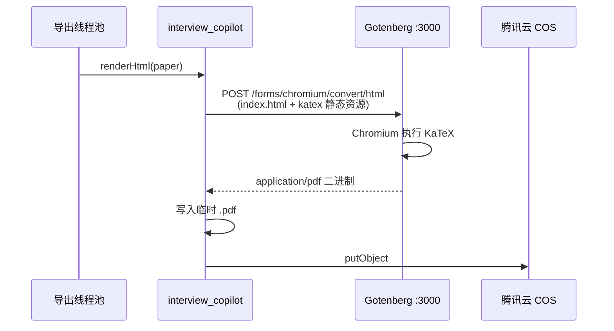

# 试卷导出：Gotenberg 中间件接入指南

> 面向本项目 `interview_copilot`（Spring Boot 2.7.2 / Java 8）  
> 前置：已有 FreeMarker `exam_paper.ftl`、异步 `export_task`、`ExamPaperExportHelper`  
> 关联：[组卷与导出功能设计](./组卷与导出功能设计.md)、[Playwright 实现指南](./试卷导出-Playwright-HTML转PDF实现指南.md)（嵌入式方案对比）

---

## 1. Gotenberg 是什么

[Gotenberg](https://github.com/gotenberg/gotenberg) 是一个 **Docker 化的文档转换 API**（Go 编写，MIT 协议，12k+ Star）。

一句话：**你把 HTML / URL / Office 文件用 HTTP 传进去，它返回 PDF**。Chromium、LibreOffice、字体等重依赖都在容器里，业务 Jar **不用自己装浏览器**。

官方定位：

> Send your files via `multipart/form-data`, get a PDF back. No need to manage Chromium, LibreOffice, or fonts yourself.

### 1.1 核心能力（与试卷导出相关）


| 能力                          | 引擎                | 本项目用途                                        |
| --------------------------- | ----------------- | -------------------------------------------- |
| HTML / URL / Markdown → PDF | Headless Chromium | `format=pdf`，KaTeX 公式需 JS 渲染                 |
| docx / xlsx / pptx → PDF    | LibreOffice       | 将来 `format=docx` 可先出 docx 再转 PDF，或直接给用户 docx |
| 合并 / 拆分 / 水印 PDF            | QPDF 等            | 多卷合并、加水印（可选）                                 |


文档：[https://gotenberg.dev/docs/getting-started/introduction](https://gotenberg.dev/docs/getting-started/introduction)

### 1.2 与「业务内嵌 Playwright」的对比


| 维度          | Gotenberg（本指南）   | 内嵌 Playwright（见另一篇文档） |
| ----------- | ---------------- | --------------------- |
| Chromium 谁管 | Gotenberg 容器     | 你的 Spring Boot 进程     |
| Jar 体积 / 内存 | 业务进程轻            | 每个 JVM 扛浏览器，内存压力大     |
| 部署          | 多一个 Docker 服务    | 单 Jar，但镜像也要装 Chromium |
| 集成方式        | HTTP `multipart` | Java API `page.pdf()` |
| 扩展          | 独立扩容渲染节点         | 跟业务线程池绑在一起            |
| 适用          | **中大规模、希望运维清晰**  | 小流量、想少一个服务            |


**推荐**：若已接受 Docker 部署，**优先 Gotenberg**；本地单机开发可先 `docker run` 起一个实例。

---

## 2. 在本项目中的位置

### 2.1 现状

```
executeExportAsync
  → buildDetailForExport()
  → renderHtml()                    // FreeMarker
  → writeHtmlToTempFile()           // 目前 pdf 也是 .html
  → cosManager.putObject()
```

### 2.2 接入 Gotenberg 后

```
executeExportAsync
  → buildDetailForExport()
  → renderHtml()
  → ┌─ format=html  → 本地写 .html → 上传 COS
  └─ format=pdf   → GotenbergClient.convertHtmlToPdf(html, assets)
                    → 得到 .pdf 临时文件 → 上传 COS
  → markSuccess(fileUrl, snapshotJson)
```




**改动面**：新增 `GotenbergClient` + `GotenbergPdfConverter`，接入现有「格式转换器」抽象；`ExportTaskServiceImpl` 仅替换 `format=pdf` 分支。

---

## 3. 快速体验（本地）

### 3.1 启动 Gotenberg

```bash
docker run --rm -p 3000:3000 gotenberg/gotenberg:8
```

健康检查：浏览器或 `curl http://localhost:3000/health`（以官方文档为准）。

### 3.2 命令行试转 HTML

准备 `index.html`（含 KaTeX 时建议带 `data-katex-ready` 标记，见 §5.2），然后：

```bash
curl --request POST http://localhost:3000/forms/chromium/convert/html \
  --form files=@index.html \
  --form 'waitForExpression=document.body.getAttribute("data-katex-ready") === "true"' \
  -o exam.pdf
```

若 HTML 引用了同目录下的 `katex/katex.min.css` 等，需 **一并上传**：

```bash
curl --request POST http://localhost:3000/forms/chromium/convert/html \
  --form files=@index.html \
  --form files=@katex/katex.min.css \
  --form files=@katex/katex.min.js \
  --form files=@katex/auto-render.min.js \
  --form 'waitForExpression=document.body.getAttribute("data-katex-ready") === "true"' \
  -o exam.pdf
```

---

## 4. 部署

### 4.1 docker-compose（推荐与业务并列）

在项目根目录或 `deploy/` 下增加 `docker-compose.yml` 片段：

```yaml
services:
  gotenberg:
    image: gotenberg/gotenberg:8
    container_name: gotenberg
    ports:
      - "3000:3000"
    # 生产建议限制内存；Chromium 单实例约 150MB+，并发时按页数扩容
    deploy:
      resources:
        limits:
          memory: 2G
    restart: unless-stopped

  # interview_copilot:
  #   image: your-app:latest
  #   depends_on:
  #     - gotenberg
  #   environment:
  #     GOTENBERG_BASE_URL: http://gotenberg:3000
```

**注意**：业务容器内访问 Gotenberg 用服务名 `http://gotenberg:3000`，不要用 `localhost`（那是容器自己）。

### 4.2 资源配置建议


| 场景    | 内存                       | 说明                           |
| ----- | ------------------------ | ---------------------------- |
| 开发单机  | 1~2 GB                   | 偶尔导出                         |
| 生产    | 2 GB+ / 实例               | 与并发 PDF 数相关；可水平起多个 Gotenberg |
| 与业务同机 | 业务 JVM 与 Gotenberg 分开限内存 | 避免 OOM 互相拖死                  |


Gotenberg 内部已池化 Chromium；你方 **导出线程池并发不宜远大于 Gotenberg 能承受的并行度**（建议 PDF 并发 ≤ 4，与现有 `exportExecutor` 一致）。

---

## 5. 模板与 KaTeX（必做）

### 5.1 为何必须本地化 KaTeX

当前 `exam_paper.ftl` 使用 jsdelivr CDN。Gotenberg 容器 **可能无法访问外网**，或访问慢导致超时。

**做法**：将 KaTeX 放到 `src/main/resources/static/katex/`，PDF 专用模板改为相对路径：

```html
<link rel="stylesheet" href="katex/katex.min.css"/>
<script src="katex/katex.min.js"></script>
<script src="katex/auto-render.min.js"></script>
```

调用 Gotenberg 时，把 `index.html` 与 `katex/*` 作为 **多个 `files` 表单项** 上传，且 HTML 内引用路径与上传后的相对路径一致。

### 5.2 等待公式渲染完成

Chromium 转 PDF 前，必须等 KaTeX 执行完。在 `exam_paper.ftl` 底部：

```html
<script>
document.addEventListener("DOMContentLoaded", function () {
    renderMathInElement(document.body, { /* delimiters ... */ });
    document.body.setAttribute("data-katex-ready", "true");
});
</script>
```

请求 Gotenberg 时传：

```
waitForExpression=document.body.getAttribute("data-katex-ready") === "true"
```

也可设 `waitDelay=1s` 作为兜底（题量大时不如表达式稳）。

### 5.3 中文字体

Linux 容器默认可能缺中文字体。可选：

- 自定义 Gotenberg 镜像，`Dockerfile` 里 `apt install fonts-noto-cjk`
- 或 CSS 指定已有字体并随 HTML 嵌入 `@font-face`（base64 字体）

否则 PDF 中文可能方框。

---

## 6. 配置项（application.yml）

```yaml
export:
  gotenberg:
    enabled: true
    base-url: http://localhost:3000          # 生产: http://gotenberg:3000
    connect-timeout-ms: 5000
    read-timeout-ms: 120000                  # 大卷 PDF 适当加大
  pdf:
    wait-for-expression: 'document.body.getAttribute("data-katex-ready") === "true"'
    paper-width: 8.27                          # A4 英寸，可选
    paper-height: 11.7
    margin-top: 0.39                           # 约 10mm，单位 in
    margin-bottom: 0.39
    margin-left: 0.59
    margin-right: 0.59
    print-background: true
```

对应 Java 配置类 `ExportGotenbergProperties`（`@ConfigurationProperties(prefix = "export.gotenberg")`）。

---

## 7. Java 接入代码

### 7.1 依赖

无需 Gotenberg 专用 SDK，**HTTP 客户端 + multipart** 即可。项目已有 Hutool：

```xml
<!-- 已有 hutool-all，无需新增 -->
```

若偏好 Spring 生态，可用 `RestTemplate` / `OkHttp` 构造 `multipart/form-data`。

### 7.2 GotenbergClient（核心）

新建 `com.fu.math_copilot.manager.GotenbergClient`：

```java
@Slf4j
@Component
@RequiredArgsConstructor
public class GotenbergClient {

    private final ExportGotenbergProperties properties;

    private static final String HTML_CONVERT_PATH = "/forms/chromium/convert/html";

    /**
     * @param indexHtml      主 HTML 内容（将保存为 index.html 上传）
     * @param assetFiles     附属资源，key 为 multipart 中的文件名，如 katex/katex.min.css
     */
    public byte[] convertHtmlToPdf(String indexHtml, Map<String, byte[]> assetFiles) {
        if (!properties.isEnabled()) {
            throw new BusinessException(ErrorCode.OPERATION_ERROR, "Gotenberg 未启用");
        }
        String url = properties.getBaseUrl() + HTML_CONVERT_PATH;

        try {
            HttpRequest request = HttpRequest.post(url)
                    .timeout(properties.getReadTimeoutMs())
                    .setConnectionTimeout(properties.getConnectTimeoutMs());

            // 主 HTML：Gotenberg 要求其中有一个 index.html
            request.form("files", indexHtml.getBytes(StandardCharsets.UTF_8), "index.html");

            if (assetFiles != null) {
                assetFiles.forEach((name, bytes) -> request.form("files", bytes, name));
            }

            // 等待 KaTeX（与 ftl 中 data-katex-ready 配合）
            request.form("waitForExpression", properties.getWaitForExpression());
            request.form("printBackground", "true");
            request.form("paperWidth", properties.getPaperWidth());
            request.form("paperHeight", properties.getPaperHeight());

            HttpResponse response = request.execute();
            if (!response.isOk()) {
                log.error("Gotenberg 转换失败, status={}, body={}", response.getStatus(), response.body());
                throw new BusinessException(ErrorCode.SYSTEM_ERROR, "PDF 生成失败");
            }
            return response.bodyBytes();
        } catch (BusinessException e) {
            throw e;
        } catch (Exception e) {
            log.error("调用 Gotenberg 异常", e);
            throw new BusinessException(ErrorCode.SYSTEM_ERROR, "PDF 服务不可用");
        }
    }
}
```

> 说明：Hutool `form("files", bytes, fileName)` 可多次调用，等价于多个 `files` part。具体 API 以你使用的 Hutool 版本为准，必要时改用 Apache HttpClient `MultipartEntityBuilder`。

### 7.3 加载 classpath 中的 KaTeX 资源

```java
@Component
public class ExamPaperAssetLoader {

    public Map<String, byte[]> loadKatexAssets() throws IOException {
        Map<String, byte[]> assets = new HashMap<>();
        ResourcePatternResolver resolver = new PathMatchingResourcePatternResolver();
        Resource[] resources = resolver.getResources("classpath:static/katex/*");
        for (Resource res : resources) {
            if (res.isReadable() && res.getFilename() != null) {
                assets.put("katex/" + res.getFilename(), StreamUtils.copyToByteArray(res.getInputStream()));
            }
        }
        return assets;
    }
}
```

渲染 HTML 时，确保 `exam_paper.ftl` 里引用 `katex/...`，与 map 的 key 一致。

### 7.4 GotenbergPdfConverter（接入格式转换器）

```java
@Component
@RequiredArgsConstructor
public class GotenbergPdfConverter implements ExamPaperFormatConverter {

    private final GotenbergClient gotenbergClient;
    private final ExamPaperAssetLoader assetLoader;
    private final ExamPaperExportHelper exportHelper;

    @Override
    public boolean supports(String format) {
        return ExportFormatEnum.PDF.getValue().equals(format);
    }

    @Override
    public File convert(String html) throws Exception {
        Map<String, byte[]> assets = assetLoader.loadKatexAssets();
        byte[] pdfBytes = gotenbergClient.convertHtmlToPdf(html, assets);
        File pdf = File.createTempFile("exam_export_", ".pdf");
        FileUtil.writeBytes(pdfBytes, pdf);
        return pdf;
    }

    @Override
    public String fileExtension() {
        return "pdf";
    }
}
```

### 7.5 改造 executeExportAsync

将现有：

```java
String html = examPaperExportHelper.renderHtml(paper);
String extension = examPaperExportHelper.resolveFileExtension(task.getFormat());
tempFile = examPaperExportHelper.writeHtmlToTempFile(html, extension);
```

改为：

```java
String html = examPaperExportHelper.renderHtml(paper);
ExamPaperFormatConverter converter = formatConverterFactory.getRequired(task.getFormat());
tempFile = converter.convert(html);
String extension = converter.fileExtension();
```

`format=html` 仍走 `HtmlFormatConverter` 写本地文件；`format=pdf` 走 `GotenbergPdfConverter`。

---

## 8. Gotenberg 常用 API 速查

官方文档：[https://gotenberg.dev/docs/routes](https://gotenberg.dev/docs/routes)

### 8.1 HTML → PDF（本项目主用）

```
POST /forms/chromium/convert/html
Content-Type: multipart/form-data

files=@index.html          （可多个 files）
waitForExpression=...      （可选，等 JS）
waitDelay=1s               （可选）
paperWidth=8.27
paperHeight=11.7
marginTop / marginBottom / marginLeft / marginRight
printBackground=true
landscape=false
```

响应：`200` + `Content-Type: application/pdf` 二进制流。

### 8.2 URL → PDF（可选）

若 HTML 已部署在可访问 URL（如 COS 临时链接）：

```
POST /forms/chromium/convert/url
url=https://...
```

试卷导出一般 **不推荐**（题面在私有 COS、权限复杂），优先 **upload html 文件**。

### 8.3 Office → PDF（将来 docx）

```
POST /forms/libreoffice/convert
files=@exam.docx
```

可先 poi-tl 生成 docx，再调此接口转 PDF；或 docx 直接给用户下载。

---

## 9. 错误处理与可观测性


| 现象               | 可能原因                          | 处理                              |
| ---------------- | ----------------------------- | ------------------------------- |
| 连接拒绝             | Gotenberg 未启动 / `base-url` 错误 | 健康检查、`depends_on`               |
| 504 / 超时         | 题量大、KaTeX 慢                   | 加大 `read-timeout-ms`、优化 wait 条件 |
| PDF 公式仍是 `$...$` | KaTeX 未加载 / wait 太早           | 本地化静态资源 + `waitForExpression`   |
| 中文方框             | 缺字体                           | 镜像装 Noto CJK                    |
| 429 / 队列满        | 并发过高                          | 降低 `exportExecutor` 最大线程数       |


建议日志：

- `taskId`、耗时、`format`、Gotenberg HTTP status
- 失败时记 `export_task.errorMsg`，勿把完整 HTML 打日志（体积大）

---

## 10. 安全注意

1. **Gotenberg 不要公网裸暴露**：仅内网 / Docker 网络访问；无鉴权时谁都能调。
2. **HTML 内容来自己方模板 + 题库**，仍避免把不可信用户 HTML 直接送进 Gotenberg（防 SSRF 类问题若将来支持自定义模板）。
3. 生产可在 Gotenberg 前加 **Nginx + IP 白名单** 或 mTLS。

---

## 11. 验证清单

- [ ] `docker run gotenberg:8` 后，`curl` 能将简单 `index.html` 转为 PDF
- [ ] 带 KaTeX 的 `index.html` + 本地 `katex/`*，公式正常
- [ ] `format=pdf` 导出后 `export_task.fileUrl` 以 `.pdf` 结尾
- [ ] `contentScope=both` 题目页与答案页分页正常
- [ ] Gotenberg 停服时，任务 `markFailed`，错误信息可读
- [ ] 连续 5 次导出，无 OOM；Gotenberg 内存稳定

---

## 12. 落地步骤


| 步骤  | 内容                                                     | 产出                 |
| --- | ------------------------------------------------------ | ------------------ |
| P0  | KaTeX 放 `static/katex/`，ftl 改本地路径 + `data-katex-ready` | HTML 离线可渲染         |
| P1  | `docker run` Gotenberg，手工 curl 验证                      | 确认环境               |
| P2  | `GotenbergClient` + `GotenbergPdfConverter` + 工厂       | `format=pdf` 真 PDF |
| P3  | `application.yml` + docker-compose                     | 开发/生产配置            |
| P4  | 中文字体、超时与并发调优                                           | 生产可用               |
| P5  | （可选）LibreOffice 路由支持 docx                              | Word 导出            |


---

## 13. 与 Playwright 方案如何二选一


| 选 Gotenberg     | 选内嵌 Playwright      |
| --------------- | ------------------- |
| 已有 Docker / K8s | 只有单 Jar、不想多服务       |
| 希望 PDF 与业务进程隔离  | 导出量很小               |
| 还要 docx→PDF 等格式 | 只想 PDF、想 Java 内闭环调试 |


两篇文档实现 **同一抽象接口** `ExamPaperFormatConverter`，可以配置开关切换后端实现，无需改 `export_task` 表结构。

---

## 14. 相关链接与代码索引


| 资源               | 链接                                                                                                                       |
| ---------------- | ------------------------------------------------------------------------------------------------------------------------ |
| Gotenberg GitHub | [https://github.com/gotenberg/gotenberg](https://github.com/gotenberg/gotenberg)                                         |
| 官方文档             | [https://gotenberg.dev/docs/getting-started/introduction](https://gotenberg.dev/docs/getting-started/introduction)       |
| Chromium HTML 路由 | [https://gotenberg.dev/docs/routes#html-file-into-pdf-route](https://gotenberg.dev/docs/routes#html-file-into-pdf-route) |


| 本项目路径                                                | 说明                     |
| ---------------------------------------------------- | ---------------------- |
| `ExportTaskServiceImpl#executeExportAsync`           | 接入转换器                  |
| `ExamPaperExportHelper#renderHtml`                   | 继续负责 FreeMarker        |
| `resources/templates/exam_paper.ftl`                 | 需 KaTeX 本地化 + ready 标记 |
| [Playwright 实现指南](./试卷导出-Playwright-HTML转PDF实现指南.md) | 不部署 Gotenberg 时的替代方案   |


---

## 15. 面试讲法（30 秒）

> 预览走 JSON + 前端 KaTeX；导出在服务端 FreeMarker 出 HTML，PDF 不自己嵌 Chromium，而是调 Gotenberg 容器：multipart 上传 HTML 和 KaTeX 静态资源，用 `waitForExpression` 等公式渲染完再打印成 PDF，最后上传 COS。这样业务和渲染解耦，Gotenberg 可独立扩容，也和业内 SaaS 用专用 PDF 服务的做法一致。

