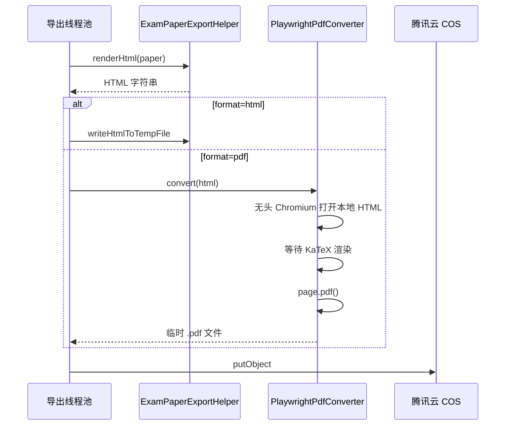

# 试卷导出：Headless Chrome / Playwright（HTML → PDF）实现指南

> 面向本项目 `interview_copilot`（Spring Boot 2.7.2 / Java 8）  
> 前置：已有 FreeMarker 渲染 `exam_paper.ftl`、异步 `export_task`、`ExamPaperExportHelper`  
> 关联：[组卷与导出功能设计](./组卷与导出功能设计.md) §6.1

---

## 1. 概念速览

### 1.1 无头浏览器（Headless Browser）是什么

**无头浏览器** = 没有界面的真实浏览器（Chromium / Chrome）。

- 能执行 HTML、CSS、JavaScript（和用户打开的 Chrome 同一套引擎）
- 不弹出窗口，在服务器后台跑
- 常用能力：截图、打印 PDF、爬取动态页面

你们导出场景里，题干是 LaTeX（`$f(x)=x^2$`），模板里用 **KaTeX（JS）** 把公式画出来。纯 Java PDF 库看不懂 JS，**必须用能跑 JS 的浏览器**，等 KaTeX 画完再「打印」成 PDF。

### 1.2 Playwright 是什么

[Playwright](https://playwright.dev/java/) 是微软出的**浏览器自动化库**，支持 Java / Node / Python 等。

| 对比 | 说明 |
|------|------|
| vs Selenium | API 更现代，自带等待机制，PDF 一行 API |
| vs Puppeteer | Puppeteer 偏 Node；Playwright 有 **官方 Java 绑定**，适合你们 Spring Boot 项目 |
| vs 用户手动打印 | 服务端批量、异步、结果可复现 |

典型调用：

```java
page.navigate("file:///tmp/exam.html");
page.waitForSelector(".katex");  // 等公式渲染完
page.pdf(new Page.PdfOptions().setPath(Paths.get("out.pdf")));
```

---

## 2. 在本项目中的位置

### 2.1 现状

```
executeExportAsync
  → buildDetailForExport()     // JSON 题面
  → renderHtml()                 // FreeMarker → HTML 字符串
  → writeHtmlToTempFile()        // 写 .html（pdf 格式目前也是 .html）
  → cosManager.putObject()
```

### 2.2 接入 Playwright 后

```
executeExportAsync
  → buildDetailForExport()
  → renderHtml()
  → ┌─ format=html → writeHtmlToTempFile(.html)
  └─ format=pdf  → PlaywrightPdfConverter.convert(html) → .pdf
  → cosManager.putObject()
  → markSuccess(fileUrl 带正确后缀)
```

**改动面**：在 `ExamPaperExportHelper` 与 `ExportTaskServiceImpl` 之间加一层 **格式转换器**，不动组卷与预览接口。



---

## 3. 实现前必读：KaTeX 与网络

当前 `exam_paper.ftl` 使用 **jsdelivr CDN** 加载 KaTeX：

```html
<link rel="stylesheet" href="https://cdn.jsdelivr.net/npm/katex@0.16.9/dist/katex.min.css"/>
<script defer src="https://cdn.jsdelivr.net/npm/katex@0.16.9/dist/contrib/auto-render.min.js"></script>
```

服务端转 PDF 时：

| 情况 | 结果 |
|------|------|
| 服务器能访问外网 CDN | 可能成功，但慢、不稳定 |
| 内网 / 离线部署 | **公式全是原始 `$...$` 文本** |

**必须做**：把 KaTeX 静态资源放到 `src/main/resources/static/katex/`，模板改为相对路径或 `file://` 可访问的本地引用（见 §5.2）。

---

## 4. 依赖与安装

### 4.1 Maven（`pom.xml`）

```xml
<dependency>
    <groupId>com.microsoft.playwright</groupId>
    <artifactId>playwright</artifactId>
    <version>1.44.0</version>
</dependency>
```

> Java 8 可用 1.40+ 版本；首次使用需下载 Chromium（约 150MB）。

### 4.2 安装浏览器内核

**开发机（Windows）**：

```bash
mvn exec:java -e -D exec.mainClass=com.microsoft.playwright.CLI -D exec.args="install chromium"
```

或在项目中写一次性初始化类调用 `Playwright.create()` 后执行 CLI install（见官方文档）。

**Linux 服务器 / Docker**：除 Chromium 外还需系统库，Docker 见 §8。

### 4.3 配置项（`application.yml` 建议新增）

```yaml
export:
  pdf:
    enabled: true
    # 单次转 PDF 超时（毫秒）
    timeout-ms: 120000
    # 等待 KaTeX 选择器超时
    katex-wait-ms: 30000
    # 是否在无 Playwright 环境时降级为 html
    fallback-to-html: false
```

---

## 5. 代码实现

### 5.1 接口：格式转换器

新建包 `com.fu.math_copilot.service.export`：

```java
public interface ExamPaperFormatConverter {

    /** 是否支持该格式 */
    boolean supports(String format);

    /**
     * 将 HTML 转为目标文件
     * @param html FreeMarker 渲染结果
     * @return 临时文件（调用方负责删除）
     */
    File convert(String html) throws Exception;

    /** 上传 COS 用的扩展名 */
    String fileExtension();
}
```

### 5.2 改造 `exam_paper.ftl`（PDF 专用或共用）

**方案 A（推荐）**：新增 `exam_paper_pdf.ftl`，KaTeX 走本地静态资源：

```html
<link rel="stylesheet" href="/katex/katex.min.css"/>
<script src="/katex/katex.min.js"></script>
<script src="/katex/auto-render.min.js"></script>
```

Playwright 打开 HTML 时，通过 **内嵌 base64** 或 **临时目录旁放 katex 文件夹** 解决路径问题（见 5.4）。

**方案 B**：渲染 HTML 后字符串替换 CDN 为 `file://` 绝对路径（hack，不推荐长期用）。

**PDF 模板底部**：在 `renderMathInElement` 完成后设标记，便于 Playwright 等待：

```html
<script>
document.addEventListener("DOMContentLoaded", function () {
    renderMathInElement(document.body, { /* ... */ });
    document.body.setAttribute("data-katex-ready", "true");
});
</script>
```

### 5.3 `HtmlFormatConverter`（保持现状）

```java
@Component
public class HtmlFormatConverter implements ExamPaperFormatConverter {

    private final ExamPaperExportHelper helper;

    @Override
    public boolean supports(String format) {
        return ExportFormatEnum.HTML.getValue().equals(format);
    }

    @Override
    public File convert(String html) {
        return helper.writeHtmlToTempFile(html, "html");
    }

    @Override
    public String fileExtension() {
        return "html";
    }
}
```

### 5.4 `PlaywrightPdfConverter`（核心）

```java
@Slf4j
@Component
@RequiredArgsConstructor
public class PlaywrightPdfConverter implements ExamPaperFormatConverter {

    private final ExportPdfProperties properties;

    @Override
    public boolean supports(String format) {
        return ExportFormatEnum.PDF.getValue().equals(format);
    }

    @Override
    public File convert(String html) throws Exception {
        // 1. 临时目录：exam.html + katex/ 静态资源拷贝
        Path workDir = Files.createTempDirectory("exam_pdf_");
        Path htmlPath = workDir.resolve("exam.html");
        Files.write(htmlPath, html.getBytes(StandardCharsets.UTF_8));
        copyKatexAssets(workDir.resolve("katex"));

        // 2. 将模板中的 /katex/ 改为相对路径 ./katex/（若尚未改 ftl）

        File pdfFile = File.createTempFile("exam_export_", ".pdf");

        try (Playwright playwright = Playwright.create()) {
            Browser browser = playwright.chromium().launch(
                    new BrowserType.LaunchOptions().setHeadless(true));
            try (BrowserContext context = browser.newContext()) {
                Page page = context.newPage();
                page.navigate(htmlPath.toUri().toString());
                // 3. 等待 KaTeX 渲染完成
                page.waitForSelector("[data-katex-ready='true']",
                        new Page.WaitForSelectorOptions()
                                .setTimeout(properties.getKatexWaitMs()));
                // 4. 打印 PDF
                page.pdf(new Page.PdfOptions()
                        .setPath(pdfFile.toPath())
                        .setFormat("A4")
                        .setPrintBackground(true)
                        .setMargin(new Margin()
                                .setTop("20mm")
                                .setBottom("20mm")
                                .setLeft("15mm")
                                .setRight("15mm")));
            } finally {
                browser.close();
            }
        } finally {
            FileUtil.del(workDir.toFile());
        }
        return pdfFile;
    }

    private void copyKatexAssets(Path targetDir) throws IOException {
        // 从 classpath:static/katex/ 拷贝到 targetDir
        ResourcePatternResolver resolver = new PathMatchingResourcePatternResolver();
        Resource[] resources = resolver.getResources("classpath:static/katex/**");
        for (Resource res : resources) {
            if (res.isReadable() && !res.getURL().toString().endsWith("/")) {
                String filename = res.getFilename();
                Files.copy(res.getInputStream(), targetDir.resolve(filename),
                        StandardCopyOption.REPLACE_EXISTING);
            }
        }
    }

    @Override
    public String fileExtension() {
        return "pdf";
    }
}
```

### 5.5 工厂 + 改造 `ExamPaperExportHelper`

```java
@Component
@RequiredArgsConstructor
public class ExamPaperFormatConverterFactory {

    private final List<ExamPaperFormatConverter> converters;

    public ExamPaperFormatConverter getRequired(String format) {
        return converters.stream()
                .filter(c -> c.supports(format))
                .findFirst()
                .orElseThrow(() -> new BusinessException(ErrorCode.PARAMS_ERROR, "不支持的导出格式"));
    }
}
```

`resolveFileExtension` 改为委托工厂：

```java
public String resolveFileExtension(String format) {
    return formatConverterFactory.getRequired(format).fileExtension();
}
```

### 5.6 改造 `executeExportAsync`

```java
String html = examPaperExportHelper.renderHtml(paper);
ExamPaperFormatConverter converter = formatConverterFactory.getRequired(task.getFormat());
tempFile = converter.convert(html);
String extension = converter.fileExtension();
String fileKey = String.format("/exam_export/%s/%s.%s",
        task.getUserId(), taskId, extension);
```

`finally` 中继续 `tempFile.delete()`。

---

## 6. Browser 实例管理（性能）

**不要**每次 `convert` 都 `Playwright.create()` + `install`（太慢）。

推荐两种模式：

| 模式 | 做法 | 适用 |
|------|------|------|
| **每任务启停** | 每次 export 创建 Browser，用完 close | 导出量小、实现简单（上文示例） |
| **单例 Browser + 每任务新 Page** | `@PostConstruct` 启动一个 Chromium，任务结束只关 Page | 导出频繁、需控制并发 |

单例示例要点：

```java
@Component
public class PlaywrightHolder implements DisposableBean {
    private Playwright playwright;
    private Browser browser;

    @PostConstruct
    public void init() {
        playwright = Playwright.create();
        browser = playwright.chromium().launch(new BrowserType.LaunchOptions().setHeadless(true));
    }

    public Browser getBrowser() {
        return browser;
    }

    @Override
    public void destroy() {
        if (browser != null) browser.close();
        if (playwright != null) playwright.close();
    }
}
```

**并发**：你们导出线程池核心 2、最大 4，与 Browser 实例数对齐；避免 10 个线程同时 `page.pdf()` 把内存打满。

---

## 7. 与现有异步任务配合

| 项 | 建议 |
|----|------|
| 进度 | `markProcessing(10)` → 渲染 HTML `30` → PDF 转换 `60` → 上传 `80` → `100` |
| 超时 | 单任务 PDF 建议 60~120s，超时 `markFailed` |
| 降级 | `export.pdf.fallback-to-html=true` 时，Playwright 失败可写 `.html` 并备注 `errorMsg` 可选 |
| 幂等 | 不变，仍靠 `idempotentKey` + `pending` 状态机 |

---

## 8. Docker 部署

Playwright 官方镜像（示例）：

```dockerfile
FROM mcr.microsoft.com/playwright/java:v1.44.0-jammy

COPY target/interview_copilot-0.0.1-SNAPSHOT.jar app.jar
ENTRYPOINT ["java", "-jar", "/app.jar"]
```

自建镜像需在 Ubuntu 安装依赖（`libnss3`、`libatk1.0-0` 等），直接参考 [Playwright Docker 文档](https://playwright.dev/java/docs/docker)。

**资源**：建议容器内存 ≥ 2GB；并发 PDF 数 ≤ CPU 核数。

---

## 9. 验证清单

- [ ] `format=html`：下载 `.html`，浏览器公式正常
- [ ] `format=pdf`：下载 `.pdf`，公式为排版后的数学符号而非 `$...$`
- [ ] `contentScope=both`：题目页与答案页分页正确
- [ ] 断网服务器（无 CDN）：PDF 公式仍正常（本地 KaTeX）
- [ ] 20 题 / 100 题卷：耗时与内存可接受
- [ ] 连续提交 5 个导出：线程池不 OOM
- [ ] `export_task.fileUrl` 后缀与真实文件一致（`.pdf`）

---

## 10. 常见问题

### Q1：PDF 里公式还是 LaTeX 原文

- KaTeX 未加载成功 → 检查本地静态资源路径
- `waitForSelector` 太早 → 改为等 `[data-katex-ready]` 或 `page.waitForFunction`
- 用了 CDN 但服务器无外网

### Q2：`playwright install` 失败

- Windows：杀毒软件拦截；换管理员终端
- Linux：缺 `libgbm1` 等，用官方 Docker 或 `playwright install-deps`

### Q3：中文乱码

- HTML `<meta charset="utf-8"/>`
- `Files.write` 使用 `UTF-8`
- PDF 字体：可在 CSS 指定 `font-family: "Microsoft YaHei", "Noto Sans SC", sans-serif`；Linux 需安装中文字体

### Q4：和 Selenium 选哪个

- 只做 **HTML→PDF**：Playwright API 更简单
- 已有 Selenium 基建：可用 ChromeDriver `--headless` + `printToPDF`，原理相同

---

## 11. 落地步骤（建议顺序）

| 步骤 | 内容 | 产出 |
|------|------|------|
| P0 | 下载 KaTeX 到 `static/katex/`，改 ftl 本地引用 + `data-katex-ready` | 离线可渲染 HTML |
| P1 | 引入 Playwright 依赖，`PlaywrightPdfConverter` + 工厂 | `format=pdf` 出真 PDF |
| P2 | `PlaywrightHolder` 单例 Browser，调线程池并发 | 性能稳定 |
| P3 | Docker 官方 Playwright 镜像 | 生产可部署 |
| P4 | 监控导出耗时、失败率；可选降级 html | 可运维 |

---

## 12. 相关代码索引

| 路径 | 说明 |
|------|------|
| `ExportTaskServiceImpl#executeExportAsync` | 异步导出入口，接入转换器 |
| `ExamPaperExportHelper#renderHtml` | FreeMarker 渲染，保持不变 |
| `resources/templates/exam_paper.ftl` | 需适配本地 KaTeX + PDF 等待标记 |
| `ExportFormatEnum` | `html` / `pdf` / `docx` |
| [组卷与导出功能设计](./组卷与导出功能设计.md) | 方案 C 留档、异步任务表 |

---

## 13. 面试讲法（30 秒）

> 预览走 JSON + 前端 KaTeX；导出要在服务端生成可下载 PDF，所以用 FreeMarker 出 HTML 中间产物，再用 Playwright 驱动无头 Chromium 执行 KaTeX 脚本，等公式渲染完成后 `page.pdf()` 打印。KaTeX 静态资源本地化，避免 CDN 依赖。导出走异步线程池，和 `export_task` 状态机、COS、`snapshotJson` 留档配合，实现组卷到离线试卷的闭环。
