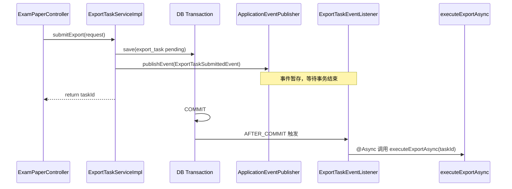

# 01 - 导出任务领域事件实战（@TransactionalEventListener）

> 手把手把 `ExportTaskServiceImpl#submitExport` 从手写 `afterCommit` 回调，重构为 **领域事件 + 事务监听器**。  
> 建议打开 IDE，对照当前 `ExportTaskServiceImpl.java` 操作。

---

## 1. 为什么要从方案 B 演进到方案 C

当前代码（方案 B）已经能工作：

```java
TransactionSynchronizationManager.registerSynchronization(new TransactionSynchronization() {
    @Override
    public void afterCommit() {
        CompletableFuture.runAsync(() -> executeExportAsync(taskId), exportExecutor);
    }
});
```

演进到方案 C 的收益：

| 维度 | 方案 B | 方案 C |
|------|--------|--------|
| Service 职责 | 写库 + 注册回调混在一起 | 写库 + `publishEvent`，调度逻辑外移 |
| 扩展性 | 每加一个 post-commit 副作用就要改 Service | 新增 Listener 即可，开闭原则 |
| 可测试性 | 难单独测「提交后是否触发导出」 | 可单测 Listener 或 mock `ApplicationEventPublisher` |
| Spring 语义 | 底层 API | 官方推荐的结构化写法 |

**本质不变**：仍然是 **事务 commit 成功之后** 才触发异步导出，只是触发方式从回调换成事件。

---

## 2. 目标文件清单

```
src/main/java/com/fu/interview_copilot/
├── event/
│   └── ExportTaskSubmittedEvent.java          ← 新建：领域事件
├── listener/
│   └── ExportTaskEventListener.java           ← 新建：事务监听器
├── config/
│   └── AsyncConfig.java                       ← 新建：@EnableAsync + 线程池 Bean
├── InterviewCopilotApplication.java           ← 修改：@EnableAsync（或只在 AsyncConfig 上开）
└── service/impl/
    └── ExportTaskServiceImpl.java             ← 修改：删 afterCommit，改 publishEvent
```

> 包名 `event` / `listener` 可按团队习惯调整；关键是 **事件与监听器不要塞在 Service 里**。

---

## 3. 整体时序



---

## 4. 分步实现

### Step 1：定义领域事件 `ExportTaskSubmittedEvent`

路径：`event/ExportTaskSubmittedEvent.java`

```java
package com.fu.math_copilot.event;

import lombok.Getter;
import org.springframework.context.ApplicationEvent;

/**
 * 导出任务已持久化为 pending，且即将在事务提交后触发异步执行。
 * <p>
 * 只携带不可变标识，不携带 ExportTask 实体（避免读到事务内旧快照）。
 */
@Getter
public class ExportTaskSubmittedEvent extends ApplicationEvent {

    private final Long taskId;

    public ExportTaskSubmittedEvent(Object source, Long taskId) {
        super(source);
        this.taskId = taskId;
    }
}
```

**设计要点**

- 继承 `ApplicationEvent`（Spring 传统事件；也可用 POJO + `@EventListener`，2.7 均支持）
- **只传 `taskId`**，不传 `ExportTask` 实体
- `source` 一般传 `this`（发布方 Service），便于排查日志

> 若团队统一 Java 17+，可改为 `record ExportTaskSubmittedEvent(Long taskId) {}` + 不继承 `ApplicationEvent`；本项目 `pom.xml` 为 Java 8，故用上面写法。

---

### Step 2：异步线程池配置 `AsyncConfig`

路径：`config/AsyncConfig.java`

把 `ExportTaskServiceImpl` 里内联的 `ThreadPoolExecutor` 提升为 Spring Bean，便于 `@Async` 引用和监控。

```java
package com.fu.math_copilot.config;

import org.springframework.context.annotation.Bean;
import org.springframework.context.annotation.Configuration;
import org.springframework.scheduling.annotation.EnableAsync;
import org.springframework.scheduling.concurrent.ThreadPoolTaskExecutor;

import java.util.concurrent.Executor;
import java.util.concurrent.ThreadPoolExecutor;

@Configuration
@EnableAsync
public class AsyncConfig {

    public static final String EXPORT_EXECUTOR = "exportExecutor";

    @Bean(EXPORT_EXECUTOR)
    public Executor exportExecutor() {
        ThreadPoolTaskExecutor executor = new ThreadPoolTaskExecutor();
        executor.setCorePoolSize(2);
        executor.setMaxPoolSize(4);
        executor.setQueueCapacity(100);
        executor.setKeepAliveSeconds(60);
        executor.setThreadNamePrefix("export-");
        executor.setRejectedExecutionHandler(new ThreadPoolExecutor.CallerRunsPolicy());
        executor.setWaitForTasksToCompleteOnShutdown(true);
        executor.setAwaitTerminationSeconds(30);
        executor.initialize();
        return executor;
    }
}
```

**说明**

- `@EnableAsync` 放在配置类即可，**不必**改 `InterviewCopilotApplication`（二选一）
- Bean 名 `exportExecutor` 与 `@Async("exportExecutor")` 对应
- `CallerRunsPolicy` 与现有逻辑一致

---

### Step 3：事务监听器 `ExportTaskEventListener`

路径：`listener/ExportTaskEventListener.java`

```java
package com.fu.math_copilot.listener;

import com.fu.math_copilot.config.AsyncConfig;
import com.fu.math_copilot.event.ExportTaskSubmittedEvent;
import com.fu.math_copilot.service.ExportTaskService;
import lombok.RequiredArgsConstructor;
import lombok.extern.slf4j.Slf4j;
import org.springframework.scheduling.annotation.Async;
import org.springframework.stereotype.Component;
import org.springframework.transaction.event.TransactionPhase;
import org.springframework.transaction.event.TransactionalEventListener;

@Component
@RequiredArgsConstructor
@Slf4j
public class ExportTaskEventListener {

    private final ExportTaskService exportTaskService;

    @Async(AsyncConfig.EXPORT_EXECUTOR)
    @TransactionalEventListener(phase = TransactionPhase.AFTER_COMMIT)
    public void onExportTaskSubmitted(ExportTaskSubmittedEvent event) {
        Long taskId = event.getTaskId();
        log.info("收到导出任务提交事件, taskId={}", taskId);
        exportTaskService.executeExportAsync(taskId);
    }
}
```

**注解说明**

| 注解 | 作用 |
|------|------|
| `@TransactionalEventListener` | 绑定事务阶段；默认 `AFTER_COMMIT` |
| `phase = AFTER_COMMIT` | 显式写出，可读性更好 |
| `@Async("exportExecutor")` | 在独立线程执行，不阻塞 commit 回调线程 |

**注意：不要加 `@TransactionalEventListener` 的 `fallbackExecution = true`**

导出提交路径始终在 `@Transactional` 内，保持默认 `false`，避免无事务时误触发。

---

### Step 4：改造 `ExportTaskServiceImpl#submitExport`

#### 4.1 新增依赖

```java


```

构造器注入（`@RequiredArgsConstructor` 会自动处理）：

```java
private final ApplicationEventPublisher applicationEventPublisher;
```

#### 4.2 删除的内容

```java
// 删除 import
import org.springframework.transaction.support.TransactionSynchronization;
import org.springframework.transaction.support.TransactionSynchronizationManager;
import java.util.concurrent.CompletableFuture;

// 删除字段（线程池已迁到 AsyncConfig）
private final ThreadPoolExecutor exportExecutor = new ThreadPoolExecutor(...);
```

#### 4.3 替换 afterCommit 为 publishEvent

**改前：**

```java
Long taskId = task.getId();
TransactionSynchronizationManager.registerSynchronization(new TransactionSynchronization() {
    @Override
    public void afterCommit() {
        CompletableFuture.runAsync(() -> executeExportAsync(taskId), exportExecutor);
    }
});
log.info("导出任务提交成功, taskId={}", taskId);
return taskId;
```

**改后：**

```java
Long taskId = task.getId();
applicationEventPublisher.publishEvent(new ExportTaskSubmittedEvent(this, taskId));
log.info("导出任务提交成功, taskId={}", taskId);
return taskId;
```

#### 4.4 完整 `submitExport` 参考（仅展示尾部变化）

```java
@Override
@Transactional(rollbackFor = Exception.class)
public Long submitExport(ExamPaperExportRequest request) {
    // ... 前面校验、幂等、save 逻辑不变 ...

    Long taskId = task.getId();
    applicationEventPublisher.publishEvent(new ExportTaskSubmittedEvent(this, taskId));
    log.info("导出任务提交成功, taskId={}", taskId);
    return taskId;
}
```

`executeExportAsync` 及后续方法 **保持不动**。

---

### Step 5（推荐）：幂等命中 `pending` 时也发布事件

当前幂等逻辑：

```java
if (existed != null && !ExportStatusEnum.FAILED.getValue().equals(existed.getStatus())) {
    return existed.getId();
}
```

若历史 bug 或进程崩溃留下 **僵尸 pending**，直接 return 不会重新触发导出。建议改为：

```java
if (existed != null && !ExportStatusEnum.FAILED.getValue().equals(existed.getStatus())) {
    Long existedId = existed.getId();
    if (ExportStatusEnum.PENDING.getValue().equals(existed.getStatus())) {
        applicationEventPublisher.publishEvent(new ExportTaskSubmittedEvent(this, existedId));
        log.info("幂等命中 pending 任务，重新调度导出, taskId={}", existedId);
    }
    return existedId;
}
```

**为何安全**：`executeExportAsync` 入口已校验 `status == pending`，`processing/success` 不会被重复执行。

---

## 5. 与方案 B 的等价关系

| 方案 B | 方案 C |
|--------|--------|
| `registerSynchronization(afterCommit)` | `@TransactionalEventListener(AFTER_COMMIT)` |
| `CompletableFuture.runAsync(..., exportExecutor)` | `@Async("exportExecutor")` |
| 回调写在 Service 内 | 回调写在 `ExportTaskEventListener` |

Spring 内部：`@TransactionalEventListener(AFTER_COMMIT)` 同样通过 `TransactionSynchronization` 注册，**语义等价**，只是多了一层事件解耦。

---

## 6. 验证步骤

### 6.1 启动检查

重启应用后确认日志无报错，尤其关注：

- `AsyncConfig` 被加载
- 无 `No qualifying bean of type 'Executor' named 'exportExecutor'` 之类错误

### 6.2 正常提交导出

1. 调用 `POST /api/examPaper/export`（带有效 `paperId`）
2. 观察日志顺序（大致）：

```
INFO  ExportTaskServiceImpl     - 导出任务提交成功, taskId=10
INFO  ExportTaskEventListener   - 收到导出任务提交事件, taskId=10
INFO  ExportTaskServiceImpl     - 导出任务完成, taskId=10   （或失败日志）
```

3. 数据库 `export_task`：`pending` → `processing` → `success`

**不应再出现** `导出任务不存在, taskId=...`（除非事务真的回滚了）。

### 6.3 事务回滚时不触发

临时在 `save` 后 `throw new RuntimeException("test")`，确认：

- 无 `收到导出任务提交事件` 日志
- 数据库无新记录

### 6.4 幂等 + pending 重新调度（若做了 Step 5）

1. 手动把某任务 `status` 设为 `pending`
2. 用相同 `paperId/format/contentScope` 再次提交
3. 应看到 `幂等命中 pending 任务，重新调度导出` 且任务最终被执行

---

## 7. 常见坑与排查

### 7.1 监听器完全不执行

| 原因 | 排查 |
|------|------|
| `publishEvent` 不在 `@Transactional` 方法内 | 确认 `submitExport` 有 `@Transactional` |
| `ExportTaskEventListener` 不在 Spring 扫描包下 | 确认在 `com.fu.math_copilot` 下且有 `@Component` |
| 事务回滚了 | 查异常栈，确认 `save` 之后无未捕获异常 |

### 7.2 `@Async` 不生效（监听器同步执行）

| 原因 | 排查 |
|------|------|
| 未加 `@EnableAsync` | 确认 `AsyncConfig` 上有 |
| 同类自调用 | Listener 必须是独立 Bean（已是） |
| 通过 `this.onXxx()` 调用 | 必须通过 Spring 代理调用（事件机制已满足） |

### 7.3 仍然报「导出任务不存在」

- 说明异步仍在 commit **之前**执行 → 检查是否误用 `@EventListener` 而非 `@TransactionalEventListener`
- 或 `submitExport` 的 `@Transactional` 被代理绕过（如类内自调用）

### 7.4 `UserContext` 在异步线程为空

本项目 `executeExportAsync` 用 `task.getUserId()`，**不依赖** `UserContext`，一般无问题。  
若未来 Listener 需要当前登录用户，在 **发布事件前** 把 `userId` 放进事件字段：

```java
public class ExportTaskSubmittedEvent extends ApplicationEvent {
    private final Long taskId;
    private final Long userId;  // commit 前从 UserContext 取出写入
}
```

### 7.5 循环依赖

`ExportTaskEventListener` → `ExportTaskService` → `ApplicationEventPublisher` 通常无环。  
若 Listener 注入 `ExportTaskServiceImpl` 具体类且 Service 又注入 Listener，才可能环；保持注入接口即可。

---

## 8. 扩展：再加一个监听器（体会解耦）

例如「导出提交后写操作审计日志」，**无需改** `ExportTaskServiceImpl`：

```java
@Component
@Slf4j
public class ExportAuditListener {

    @TransactionalEventListener(phase = TransactionPhase.AFTER_COMMIT)
    public void onExportTaskSubmitted(ExportTaskSubmittedEvent event) {
        log.info("[审计] 用户提交导出, taskId={}", event.getTaskId());
        // 未来可写 audit_log 表
    }
}
```

同步执行、轻量副作用，可不加 `@Async`。  
重量级副作用（调 Gotenberg、传 COS）留在 `ExportTaskEventListener` 且 `@Async`。

---

## 9. 可选进阶（本文不展开实现）

| 项 | 说明 | 文档 |
|----|------|------|
| pending 超时扫描 | 进程崩溃后的兜底 | [事务提交后触发异步任务最佳实践](../事务提交后触发异步任务最佳实践.md) §3.4 |
| `@Scheduled` 恢复任务 | 需 `@EnableScheduling`（项目里 ES 同步 job 已有先例） | 同上 §6.3 |
| Transactional Outbox | 跨服务、消息必达 | 同上 §3.5 |

---

## 10. 改造 Checklist

复制到 PR 描述或自用勾选：

```
[ ] 新建 ExportTaskSubmittedEvent
[ ] 新建 AsyncConfig（@EnableAsync + exportExecutor Bean）
[ ] 新建 ExportTaskEventListener
[ ] ExportTaskServiceImpl：注入 ApplicationEventPublisher
[ ] ExportTaskServiceImpl：删除 TransactionSynchronization / 内联线程池
[ ] ExportTaskServiceImpl：save 后 publishEvent
[ ] （推荐）幂等 pending 分支也 publishEvent
[ ] 重启验证：提交导出 → 事件日志 → success
[ ] 验证：故意回滚 → 无事件触发
```

---

## 11. 面试 30 秒版

> 导出任务在事务里 insert 后，不能立刻异步查库，否则读不到未提交数据。我们用 `ApplicationEventPublisher` 发布 `ExportTaskSubmittedEvent`，由 `@TransactionalEventListener(AFTER_COMMIT)` 保证 commit 后再执行，再配合 `@Async` 和独立线程池做 PDF 渲染。Service 只负责写库和发事件，调度在 Listener，后续加审计、告警只要新增监听器，符合开闭原则。

---

## 12. 参考资料

- [Spring Framework — @TransactionalEventListener](https://docs.spring.io/spring-framework/docs/5.3.x/reference/html/data-access.html#transaction-event)
- [Bart Slota — Transaction synchronization and Spring application events](https://www.bartslota.com/post/transaction-synchronization-and-spring-application-events-understanding-transactionaleventlistene)
- 本项目 [事务提交后触发异步任务最佳实践](../事务提交后触发异步任务最佳实践.md)
- 本项目 [组卷与导出功能设计](../组卷与导出功能设计.md)
